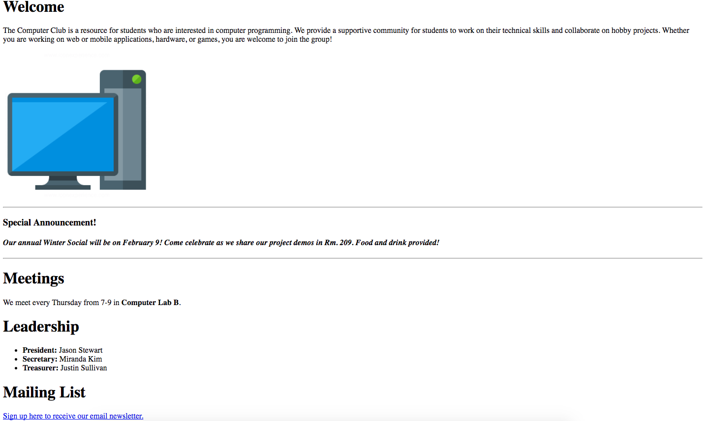
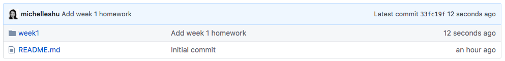
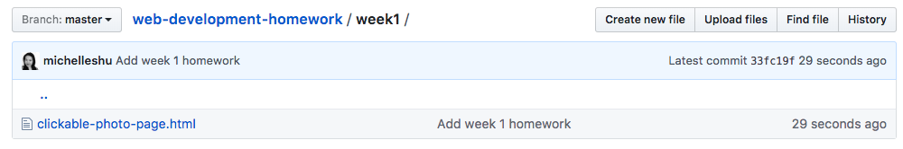

[Back to schedule](../schedule.md) | [Week 1 Lecture](../lectures/01.md)

# Week 1 Homework: Git & HTML

This week's homework assignment will be to complete the Codeacademy lessons on HTML, create a website with HTML, and submit it to GitHub through a **pull request**.

As a reminder, the HTML lessons are the sections titled **Introduction to HTML**, **HTML Structure: Using Lists** and **HTML Structure: Tables, Divs and Spans** on the [Codeacademy Web Development track](https://www.codecademy.com/en/tracks/web). Please complete these lessons before proceeding to the assignment. The course will teach some basics you will need to complete the assignment.

## Creating a repository on GitHub

This week, we will create a repository on GitHub for all the homework assignments for this class.

1. Log in to [GitHub](https://www.github.com) and click *New Repository* under the menu bar.

2. Fill in the fields for your new repository and click **Create repository**. You can choose whichever name you'd like for the repository

3. Copy the SSH address of the newly created repository:

4. Use this address to "clone" the repository to your computer. This will link up the project on GitHub with a folder on your local computer.

  1. Open up Terminal (Mac) or Git Bash (Windows)
  2. Use `cd` to navigate to a directory that you want the project to go under.
  3. Use `git clone` followed by the SSH address of your repository that you copied in the previous step.
  4. Now when you `ls` you should see a folder with your repository name. This is the copy of the Git repository on your computer.

  

-----

## Download a text editor

If you don't already have a text editor for editing HTML, CSS and JS code on your computer, we recommend downloading either [Visual Studio Code](https://code.visualstudio.com/) or [Atom](https://atom.io/). While we don't need it yet, since we are operating in the Codeacademy environment, it will soon be helpful for you to work on own web development projects locally. Advanced text editors provide many useful features such as syntax highlighting and keyboard shortcuts that will make programming a lot easier!

-----

## Assignment: Student Organization Website

Your task is to produce a website for a student organization or club using HTML. The website should describe what the organization does, when the regular meeting times are, and list the student leaders. It can be based off of a real or imaginary student organization. Here's an example of what the it might look like:

The requirements for the website's homepage HTML are that it must contain *at minimum*:

- A `title` (within the head tag) that shows up on the browser tab
- Headings and paragraphs
- A list (ordered or unordered)
- An image
- Bold and italicized font

Other than that, feel free to be creative and add whichever features or information students may find useful about your organization!

Your next challenge is to link the homepage to another page that contains a form where visitors can sign up for the organization's mailing list.

## Branching and submitting code with a Pull Request

## Submit code to your repository

Once you've completed the Codeacademy lessons, create a new folder under your homework code repository called `week1`. Then copy your solution to the **Clickable Photo Page** challenge on CodeAcademy to an HTML file under the `week1` folder called `clickable-photo-page.html`. You can create this document using your text editor of choice.

Copy the code from this assignment into the HTML file:

Use the `git add`, `git commit`, and `git push` to submit your code to the repository. See [this tutorial](https://product.hubspot.com/blog/git-and-github-tutorial-for-beginners) if you need a refresher on how to use Git.

As a result, your new repository should look like this:

With the `clickable-photo-page.html` under the `week1` folder:

