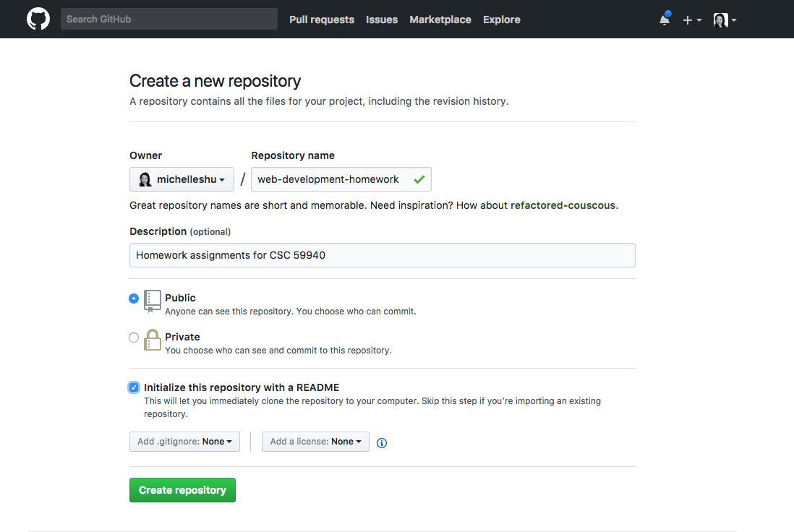
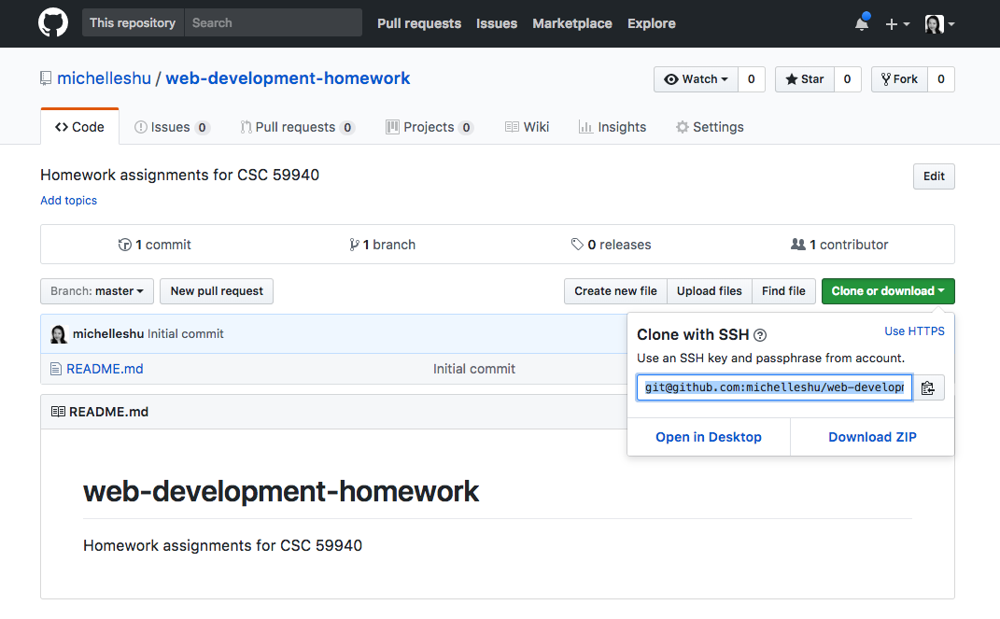
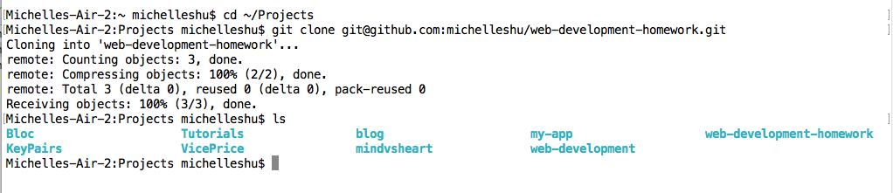

[Back to schedule](../schedule.md) | [Week 1 Lecture](../lectures/01.md)

# Week 1 Homework: Git & HTML

This week's homework assignment will be to complete the Codeacademy lessons on HTML and submit your **Clickable Photo Page** project to a GitHub repository for grading. As a reminder, the HTML lessons are the sections titled **Introduction to HTML**, **HTML Structure: Using Lists** and **HTML Structure: Tables, Divs and Spans** on the [Codeacademy Web Development track](https://www.codecademy.com/en/tracks/web).

## Creating a repository on GitHub

This week, we will create a repository on GitHub for all the homework assignments for this class.

1. Log in to [GitHub](https://www.github.com) and click *New Repository* under the menu bar.

2. Fill in the fields for your new repository and click **Create repository**. You can choose whichever name you'd like for the repository

3. Copy the SSH address of the newly created repository:

4. Use this address to "clone" the repository to your computer. This will link up the project on GitHub with a folder on your local computer.

  1. Open up Terminal (Mac) or Git Bash (Windows)
  2. Use `cd` to navigate to a directory that you want the project to go under.
  3. Use `git clone` followed by the SSH address of your repository that you copied in the previous step.
  4. Now when you `ls` you should see a folder with your repository name. This is the copy of the Git repository on your computer.

  
