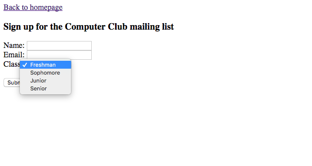

[Back to Schedule](../schedule.md)

# Week 1: Version Control, Git, HTML

---

[Version Control](#what-is-version-control)

[Git](#git)

[Lab 1.1: Intro to Git & GitHub](#lab-11-intro-to-git-github)

[Submitting Assignments](#using-git-github-to-submit-assignments)

[Additional Git Resources](#additional-git-resources)

[HTML](#what-is-html)

[HTML Basics](#html-basics)

[Additional HTML Resources](#additional-html-resources)

[Text Editors](#download-a-text-editor)

[Lab 1.2: HTML](#lab-12-html)

---

## What is version control?

Version control describes a system that keeps track of changes to a code project over time. Each change to code is tracked so that if at any time, a developer wants to turn back time to a previous version of the code, he/she is able to do so. Every project that you start working on as a web developer benefits from being tracked in a version control system, because it will record the history of all the additions and changes that happen over time to the project. When working in a group, the version control system will also help to resolve conflicts when different team members make different changes to the same line of code.

---

## Git

Git is the most widely used version control system in the software development world today. It is an open source command line tool that tracks the entire history of changes in a project, called **commits**. It also provides a powerful branch management system (e.g., a developer branches off from the project master branch, develops a feature, then merges her changes back to the master branch), which makes it easier not only for the individual programmer to keep track of her various projects, but also for a group of programmers to manage and resolve any conflicts between their concurrent changes to a shared codebase. Many software projects, both commercial and open source, are version-controlled with Git and hosted on the web service [GitHub](https://www.github.com/).

In this course, we will use Git to manage all our projects. Each of you will maintain a Git **repository**--a project directory that stores and allows you to navigate your entire Git history--and host it on GitHub. Your repository will contain all your individual homework assignments for this course. Publishing all the changes to your code on GitHub as you work on it will ensure that if any issues happen with your computer, all the saved code is secured online and you can easily recover it.

To submit your homework, we will make use of **pull requests**. A pull request is a GitHub feature (strictly GitHub, not Git) that makes it easier for collaborators to review code changes before they are merged into the project's master branch. In our case, we will use pull requests to provide feedback on your homework. The next couple sections will walk you through this process.

---

## Lab 1.1: Intro to Git & GitHub

1. Your Linux accounts should have Git pre-installed. If not, or you'd like to work on your homework on your computers at home, follow the steps [here](https://git-scm.com/book/en/v2/Getting-Started-Installing-Git) to install Git.

2. Open a terminal and tell Git who you are. Use your school email address.
    ```
    git config --global user.name "Sam Smith"
    git config --global user.email sam@example.com
    ```

3. Create a [GitHub](https://www.github.com/) account under your school email address (if you haven't already).

4. Visit https://education.github.com/pack. Click 'Get your pack' and follow the instructions to request a discounted plan. With student accounts, you'll be able to host up to 5 private repositories on your GitHub account, which is normally a paid feature.

5. Follow the steps in this [tutorial](https://product.hubspot.com/blog/git-and-github-tutorial-for-beginners) by HubSpot to get to some hands-on experience with Git and GitHub.

6. Create a new GitHub repository named `csc59940`. Make it public and check 'Initialize this repository with a README'. Later, once your discount requests are processed, we'll switch the repository over to private mode.

7. Follow the instructions [here](https://help.github.com/articles/inviting-collaborators-to-a-personal-repository/) to add us as collaborators on your repository. David's username is `dmoon1221`, Michelle's is `michelleshu`.

8. In your terminal, create a local copy of your `csc59940` GitHub repository by running
    ```
    git clone https://github.com/<your-github-username>/csc59940
    ```
    > Note: In the HubSpot tutorial, you created a local Git repository, created a GitHub repository, and linked the two by running `git remote add origin <github-repo-url>`. This created a **remote** named `origin` that points to `<github-repo-url>`, which allows you to run commands like `git push origin master` to push your local commits to the `master` branch of your GitHub repository. In this case, because we created a local repository by cloning a GitHub repository, `origin` already points to the cloned GitHub repository. 

9. Create a new branch called `lab-1.1`. Create a new directory called `lab-1.1` and move into it (`cd lab-1.1`).

10. Run the command
    ```
    echo "Paul by Big Thief" > song.txt
    ```
    to create a new file called `song.txt` whose content reads `Paul by Big Thief`.

11. Add `song.txt` to staging and commit it.

12. Now replace the content of `song.txt` by running
    ```
    echo "Conjouring by IAMDDB" > song.txt
    ```
    You're welcome to replace the file content with your song of choice.

13. Run `git diff` to inspect what changes you've made. Both `git status` and `git diff` are useful commands to remind yourself of what new changes you've made so far.
    > Note: This command will show you all changes made to files tracked by your current branch. This will not show any changes on new files that have not yet been committed.

14. Add and commit your changes to `song.txt`.

15. Run `git log` to see your commit history.

    > Optional: The following steps will add a new Git command alias `git lg` that will pretty-print your commit history. I use this command on a daily basis. It may not make much of a difference when your commit history is simple, but is much easier to grok when you start managing multiple branches.
    > 1. Open the file `~/.gitconfig`.
    > 2. Add a new section header `[alias]`.
    > 3. Under `[alias]`, add the line
        ```
        lg = log --graph --abbrev-commit --decorate --format=format:'%C(bold blue)%h%C(reset) - %C(bold cyan)%aD%C(reset) %C(bold green)(%ar)%C(reset)%C(bold yellow)%d%C(reset)%n''%C(white)%s%C(reset) %C(dim white)- %an%C(reset)'
        ```
    > 4. Save and close the file.
    > 5. Confirm by running `git lg`.

16. Push your local changes to GitHub by running
    ```
    git push origin lab-1.1
    ```
    Recall that this creates a corresponding branch on your GitHub repo named `lab-1.1` (if it doesn't already exist) and pushes your local changes to it.

17. Visit your GitHub repo and create a pull request on your pushed branch. Tag `@dmoon1221` and `@michelleshu` in the PR description. You've just submitted your first assignment for review!

18. For this lab, go ahead and merge your pull request now.

19. On your local repo, check out your `master` branch and pull the latest changes from your GitHub repo.

---

## Using Git & GitHub to submit assignments

We'll adopt a similar workflow to submit all of our assigments in this course. Submitting pull requests and receiving feedback from your collaborators is an essential workflow at any software company.

Distilling from the above, the general submission workflow will be:

1. Create a new local branch.

2. Create a corresponding remote branch of the same name by running
    ```
    git push origin <your-branch-name>
    ```

3. Commit and push your local changes as you work through the assignment.

4. Once you're ready to receive feedback, open a pull request. Describe your changes and tag `@dmoon1221` and `@michelleshu` in the PR description. We might also ask you to submit a link to your PR on Blackboard.

5. If you open the pull request by 4pm on the Friday following each Wednesday class, then we guarantee that we will return a round of feedback by the end of that Friday, no promises otherwise. In our feedback, we may request that you make certain changes. If everything looks good, we'll comment 'LGTM' (looks good to me).

6. Once you receive feedback, you have until the following Sunday evening at midnight to address any comments. You can do this by pushing local changes to the same branch you opened the pull request for. You must merge your pull request by Sunday evening midnight to receive credit. Whatever is merged is what will be graded.

## Additional Git Resources

[Creating a new repository on GitHub](https://help.github.com/articles/creating-a-new-repository/)

[Git - Getting Started with Version Control](https://git-scm.com/book/en/v2/Getting-Started-About-Version-Control)

[Atlassian Git Tutorial](https://www.atlassian.com/git/tutorials/what-is-version-control)

------

## What is HTML?

Now that we know how to use version control to start a new project, let's talk about the core language of website content: HTML. **HTML** stands for **Hyper Text Markup Language**. It is a language that uses blocks called **tags** or **elements** to describe the structure of a website. HTML is the markup language that a browser like Google Chrome reads to determine what type of content and interactive elements are on the page.

A simple HTML document may look like something like this:

```html
<!DOCTYPE html>
<html>
  <head>
    <title>My Web Page</title>
  </head>
  
  <body>
    <h1>My Heading</h1>
    <p>My first paragraph.</p>
  </body>
</html>
```

As you can see, it consists of a series of opening tags (like `<p>`) and closing tags (`</p>`) that enclose content at different levels. This is what each of the tags mean in the example above:

- The `<!DOCTYPE html>` indicates to the browser that this is an HTML document.
- The `<html>` element encloses all the HTML on the page. This is also known as a **root element**.
- The `<head>` element contains "meta" data about the page that search engines use like a title and description.
- The `<title>` element specifies a title for the web page.
- The `<body>` element contains all of the content that is visible in the browser.
- The `<h1>` element defines the largest first level heading. There are also `<h2>`, `<h3>`, `<h4>`, `<h5>`, `<h6>` for smaller headings. 
- The `<p>` element defines a paragraph.

---

## HTML Basics

### Metadata and the head tag

Every HTML document consists of a `head` and a `body`. The `head` element contains meta information that is not visible on the web page. Within the head, you will see the following:

- `<title>` specifies the title of the page that will show up on the web browser tab
- `<link>` links to external CSS files to style the page and JS to define interaction. We will learn about both in the class
- Metadata for search engines to find the website (such as description, keywords, etc)

Read more [here](https://developer.mozilla.org/en-US/docs/Learn/HTML/Introduction_to_HTML/The_head_metadata_in_HTML).

### Headings and Paragraphs

Most of the text content on a web page will either be a heading or a paragraph. Headings come at different levels in decreasing importance and size: `<h1>`, `<h2>`, `<h3>`, `<h5>`, `<h5>`, and `<h6>` and paragraphs are defined with the `<p>` tag.

### Document Structure

HTML provides several tags to provide common structure to the document as a whole:

- `<header>` for header and `<footer>` for footer
- `<nav>` for the navigation bar
- `<main>` for main content, with various content subsections represented by `<article>`, `<section>`, and `<div>` elements.
- For a generalized block of content, use `<div>`. **Divs are one of the most commonly used tags in web development.** Whenever you have a section of content inside a rectangular container that needs to be styled, it's likely that a div is the way to go!
- `<span>` is like div but only for a specific segment of inline text.

### Lists

There are two types of lists in HTML: unordered (`<ul>`) and ordered (`<ol>`). The former gives you bulleted items; the latter gives you numbered items. List elements go inside the list tag as `<li>`, as follows:

```
<ol>
  My List:
  <li>First item</li>
  <li>Second item</li>
  <li>Third item</li>
</ol>
```

### Tables

HTML allows the creation of tables in the following format:

```
<table>
  <tr>
    <th>Firstname</th>
    <th>Lastname</th> 
    <th>Age</th>
  </tr>
  <tr>
    <td>Jill</td>
    <td>Smith</td> 
    <td>50</td>
  </tr>
  <tr>
    <td>Eve</td>
    <td>Jackson</td> 
    <td>94</td>
  </tr>
</table>
```

`<tr>` describes a row, `<th>` describes a cell within the header row, and `<td>` describes a cell within a body row.

### Images

To add an image to an HTML document, you must first have a reference to the image in the form of a URL where the image is stored on the web. Then you can use an `` tag to and reference the image URL in the `src` attribute:

```

```

`img` tags are one of the tags in HTML that are *self-closing*, meaning that the `/` goes at the end of the opening tag instead of having a `</img>` tag to close it.

### Bold and Italicized Text

- For **bold** text, use the `<b>` tag.
- For *italicized* text, use the `<em>` tag.

### Forms

Forms generally involve `<form>`, `<input>`, `<select>` and `<button>` tags. We will dive deeper into how to create a form in this week's lab exercise. Here is a [good resource for how to structure a form](https://developer.mozilla.org/en-US/docs/Learn/HTML/Forms/How_to_structure_an_HTML_form).

---

## Additional HTML Resources

[Mozilla Getting Started with HTML](https://developer.mozilla.org/en-US/docs/Learn/HTML/Introduction_to_HTML/Getting_started)

[Simple HTML Cheat Sheet](http://www.simplehtmlguide.com/cheatsheet.php)


---

## Download a text editor

If you don't already have a text editor for editing HTML, CSS and JS code on your computer, we recommend downloading either [Visual Studio Code](https://code.visualstudio.com/) or [Atom](https://atom.io/). While we don't need it yet, since we are operating in the Codeacademy environment, it will soon be helpful for you to work on your own web development projects locally. Advanced text editors provide many useful features such as syntax highlighting and keyboard shortcuts that will make programming a lot easier!

---

## Lab 1.2: HTML

Your task is to produce a website for a student organization or club using HTML. The website should describe what the organization does, when the regular meeting times are, and list the student leaders. It can be based off of a real or imaginary student organization. Here's an example of what the it might look like:


The requirements for the website's homepage HTML are that it must contain *at minimum*:

- A `title` (within the head tag) that shows up on the browser tab
- Headings and paragraphs
- A list (ordered or unordered)
- An image
- Bold and italicized font
- A link to another page to sign up for the mailing list (which we will create next)

Other than that, feel free to be creative and add whichever features or information students may find useful about your organization!

Your next challenge is to link the homepage to another page that contains a form where visitors can sign up for the organization's mailing list. You can reference [this page](https://developer.mozilla.org/en-US/docs/Learn/HTML/Forms/How_to_structure_an_HTML_form) to learn the basics of HTML forms. It may also require some digging around on the internet to find how to produce these exact form inputs. Please use Google to find the answers you need! The form **does not** have to be functional, meaning it does not have to do anything when someone clicks submit (but all the elements should still be there).

The form should look like this, with two text fields for Name and Email, as well as a dropdown for Class Year:




Be sure that there is a link on the home page to reach the email signup page and there is another link from the email signup page back to the homepage.

Use the `git add`, `git commit`, and `git push` to submit your code to the repository under your `lab1` branch. See [this tutorial](https://product.hubspot.com/blog/git-and-github-tutorial-for-beginners) if you need a refresher on how to use Git.

Afterwards, make a pull request from your branch into `master` by following these `simple steps`. Submit a link to your pull request on Blackboard and an instructor will review your work.

Congratulations -- you're done with your first assignment!
