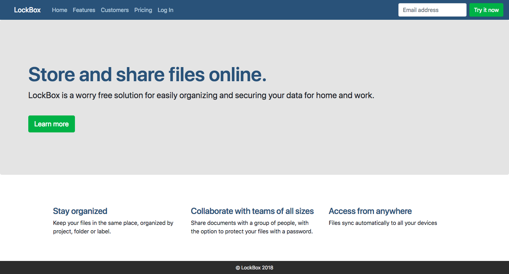

[Back to Schedule](../schedule.md)

# Week 2 Lab: Build a website using CSS and Bootstrap

For this week's lab, we will be building a website based on the [Bootstrap](https://www.getbootstrap.com) CSS library. Bootstrap provides a collection of many basic styled elements that conform to today's responsive web standards. Many startups rely on the Bootstrap framework to quickly set up a landing page without having to worry about defining all the CSS from scratch. Today we will build a landing page for a software company for private file storage called **Lockbox**.

For quick setup of your project, copy the starter template from [Bootstrap Starter Template](https://getbootstrap.com/docs/4.0/getting-started/introduction/#starter-template) to a new folder and name the file `index.html`. This template will provide all the necessary Bootstrap styles, as well as some supporting JavaScript.

The Bootstrap foundation styles won't be quite enough to cover all the styles and colors we want so also add your own custom stylesheet in a file called `style.css`. Link your own stylesheet beneath the standard Bootstrap one in `index.html` such that your `<head>` section looks like this:

```html
<head>
    <!-- Required meta tags -->
    <meta charset="utf-8">
    <meta name="viewport" content="width=device-width, initial-scale=1, shrink-to-fit=no">

    <!-- Bootstrap CSS -->
    <link rel="stylesheet" href="https://maxcdn.bootstrapcdn.com/bootstrap/4.0.0/css/bootstrap.min.css" integrity="sha384-Gn5384xqQ1aoWXA+058RXPxPg6fy4IWvTNh0E263XmFcJlSAwiGgFAW/dAiS6JXm" crossorigin="anonymous">

    <!-- My own custom CSS -->
    <link rel="stylesheet" href="style.css">

    <title>Hello, world!</title>
</head>
```

This will tell the browser: First load Bootstrap styles and then load everything in `style.css` on top of it. This way, your own custom styles will override the Bootstrap ones where applicable.

## Assignment: Build and Style a Startup Landing Page

Your challenge will be to build out the following landing page website using HTML and CSS:



This is a realistic situation that web developers face. A designer sends you an image of what they want (often referred to as a **mock**), maybe with some colors and measurements, and you are expected to build it to look exactly right. For the purposes of this class, we don't expect every pixel to be perfect. However, please make your best attempt to notice details like font sizing, spacing and alignment to get your website to look as close to the image as you can.

## Tips:

1. Use the [Bootstrap Components page](https://getbootstrap.com/docs/4.0/components/alerts/) for examples of how to add different elements to the page styled with Bootstrap classes. This design is based heavily on Bootstrap components that you can get out of the box. Instead of trying to build everything from scratch, first check the website to see if you can find an example if what you want.

2. Here are the key color hex codes for the website:
    - Dark Blue: #2F5478
    - Light Blue: #B3C6D8
    - Dark Grey: #2C2C2C
    - Light Grey: #E4E4E4

3. Remember that you can add as many CSS classes as you want to any element in order to add custom styles. It's recommended but not required that you add your own classes instead of just writing new CSS rules for the Bootstrap classes to indicate that you're adding styles that are separate from those in Bootstrap.
