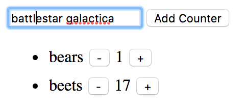

[Back to Schedule](../schedule.md)

# Week 4 Lab: CounterList

This week, we'll get some hands-on experience with JavaScript classes before we dive into React next week. The end product will be a simple web app that let you keep count of all the things you need to count in your life.

## Final Product

[Here](https://csc59940.github.io/demo/4/index.html) is a link to a demo. Below is a screenshot.

At the top of the page is a form. Enter something you'd like to count, click 'Add Counter', and a named counter will appear in the list below. Each counter has a pair of buttons that allow you to decrement and increment the count.

## Your Assignment

I've pushed starter files to your GitHub repos. To pull these files to your local machine, open a terminal and navigate to your `csc59940` directory, make sure that your current branch is `master`, and run `git pull origin master`. You should now see a `lab-4` subdirectory in your `csc59940` directory.

Inside `lab-4` is a single `index.html` file. Your task is to finish the implementation of our counter app within the `<script>` tags.

Specifically, you need to implement the following classes and their listed methods.
- `CounterList`
  - `constructor()`: initializes a `counters` field as an empty array
  - `addNewCounter(counter)`: takes a `Counter` object and adds it to the `counters` field
  - `render()`: constructs and returns a `<ul>` jQuery object, whose direct children are the jQuery objects returned by the `render()` method of each of the `Counter` objects in the `counters` array
- `Counter`
  - `constructor(name)`: takes the name of the thing you want to count and initializes a `name` field to the passed name; initializes a `count` field to `0`
  - `decrement()`: decrements the `count` field and calls the `rerenderPage()` helper function
  - `increment()`: increments the `count` field and calls the `rerenderPage()` helper function
  - `render()`: constructs and returns a `<li>` jQuery object whose direct children consist of:
    - a `` object whose text is the `name` field
    - a `<button>` object that, when clicked, calls the `decrement()` function
    - a `` object whose text is the current `count` field
    - a `<button>` object that, when clicked, calls the `increment()` function

Once you've finished your implementation, answer the following discussion questions in the comments. Each answer should be at least 2-3 complete sentences.

1. Comment out the calls to `renderPage()` within the `decrement()` and `increment()` methods and try decrementing/incrementing some counters. Describe the observed behavior, then explain why the call to `renderPage()` is necessary in these methods.
2. Try adding many counters, then incrementing a counter. Add more counters, then increment a counter. Add still more counters, then increment a counter. Repeat this process a few more times. You'll notice that there is an increasing delay in your button responsiveness as you add more counters. Now read this [article](https://www.codecademy.com/articles/react-virtual-dom) to get a sense of the "virtual DOM" underlying the React framework. Explain why we observe the performance lag in our current counter app, and describe how re-implementing our application in React could have made it better.

