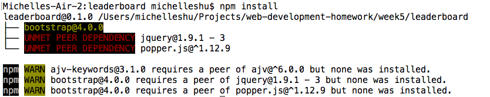
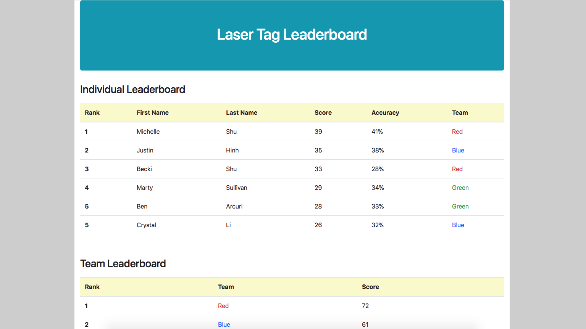
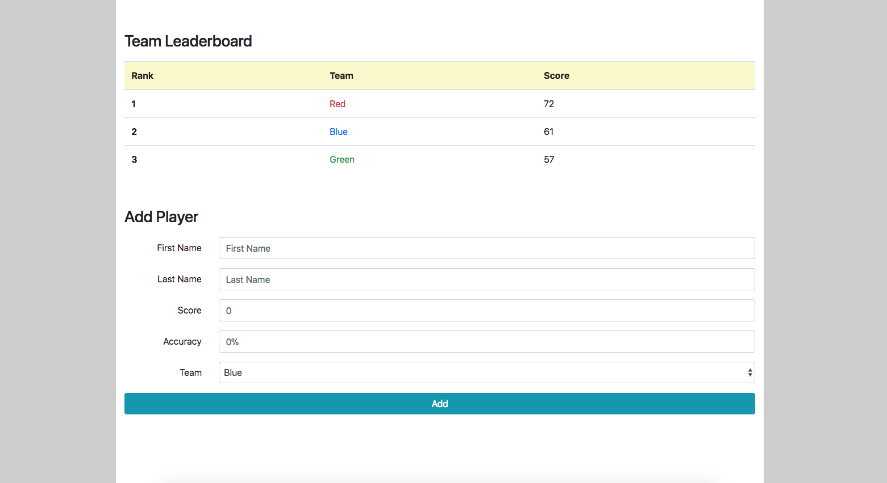

[Back to Schedule](../schedule.md)

# Week 5 Lab: Laser Tag Leaderboard Part 1

Over the next few weeks, we will build out a fully functional React application piece by piece as we learn more aspects of how to use the React framework.

The application we will build is a leaderboard to track and rank individual and team game scores (in either a single game or multiple rounds in a tournament of sorts). In the example, I will be creating a leaderboard for a laser tag game between 3 teams. For your assignments, you can choose to follow the example or build your a leaderboard of your choice: paintball, sports, video games, summer camp color wars, Harry Potter house cup, etc. - anything is fair game as long as there is a competition aspect with individual and team scores involved!

# Create a New React Application

Follow the instructions from [Week 5 Prep](../prep/05.md) to create a new React application in a `/leaderboard` directory. We will place it in `/leaderboard` folder instead of `/lab5`, since we will be working on this lab through weeks 5-8.

Remove the default files `src/App.css`, `src/App.js`, and `src/App.test.js` from the default app from `create-react-app`.

Create a new component in `/src` called `Leaderboard.js`. Make sure to use the class syntax and extend `React.Component` to declare your component. This will be our root application component. Edit `index.js` to make the `Leaderboard` component appear instead of `App`. You can write a simple `render()` method in Leaderboard and run `npm start` to make sure your new component renders as expected.

**Note**: Before you submit your assignment to git, add a file called `.gitignore` in your home directory (the same one with the folders for `lab1`, `lab2`, `leaderboard`, etc). In the .gitignore file, add:

```
node_modules/
```

This will tell git to ignore your node_module package dependencies so you don't push all your dependencies to your repository (which could be a lot of extra files!).

# Install Bootstrap with NPM

We will use Bootstrap CSS as the base style for this application, just as we did in the Week 2 CSS lab. But instead of using the CDN or downloading the whole Bootstrap library manually, we can use NPM to install it, just like any other package dependency.

Open up `package.json` and add `"bootstrap": "^4.00"` as one of the dependencies. The file should look like this after you add it:

```js
{
  "name": "leaderboard",
  "version": "0.1.0",
  "private": true,
  "dependencies": {
    "bootstrap": "^4.0.0",
    "react": "^16.2.0",
    "react-dom": "^16.2.0",
    "react-scripts": "1.1.1"
  },
  "scripts": {
    "start": "react-scripts start",
    "build": "react-scripts build",
    "test": "react-scripts test --env=jsdom",
    "eject": "react-scripts eject"
  }
}
```

Then go to your terminal, navigate to your `/leaderboard` project directory, and run `npm install` to install the package dependencies.

You'll find that you unfortunately get the following error:



This is because the bootstrap package relies on two other dependencies that aren't yet installed: jquery and popper.js. Add these with the appropriate versions to your `package.json` and rerun `npm install`. Now everything should be installed successfully.

Now that Bootstrap is installed to your npm packages, all you have to do is load it into the project with a simple import statement. To make it available everywhere, add the following line to `src/index.js`:

```js
import 'bootstrap/dist/css/bootstrap.css';
```

This will tell the application to pull this CSS file from your `node_modules/` directory and use it in the project. You should now be able to use Bootstrap classes as a foundation to add styles to the application.

# Componentize your Leaderboard

Your leaderboard application will have 3 sections: Individual Leaderboard, Team Leaderboard, and Add Player. For now, we will put all 3 sections on a single page but later, we will learn how to break it out into separate pages.

Today, we will write these components for an end result that looks like this:





Feel free to add whichever styles and columns you like for your particular leaderboard, as long as all sections are present. Also, don't worry about the data that goes into the table rows, or having the Add Player form work. For now, we can just add placeholder data and have a form that doesn't do anything, since we haven't gotten to adding interactive elements.

Create a folder under your `src/` directory called `components`. This is where the component files will live. Thinking in a React style, we will start by breaking down the main application into 3 components that will represent the 3 main section. Create `Main.js`, `IndividualLeaderboard.js`, `TeamLeaderboard.js`, and `AddPlayer.js` files under you components folder. Your directory structure should now look something like this:

```
- public
- src
    - components
        - AddPlayer.js
        - IndividualLeaderboard.js
        - Main.js
        - TeamLeaderboard.js
    - index.css
    - index.js
```

We will have `Main.js` be our main file where we will render our 3 main components from. When finished, Main should have the following `render()` function to render out the sections in order:

```js
import React from 'react';
import IndividualLeaderboard from './IndividualLeaderboard';
import TeamLeaderboard from './TeamLeaderboard';
import AddPlayer from './AddPlayer';

class Main extends React.Component {
    render() {
        return (
            <div class="container">
                <IndividualLeaderboard />
                <TeamLeaderboard />
                <AddPlayer />
            </div>
        );
    }
}

export default Main;
```

Then change the `ReactDOM.render` in `index.js` to render the `Main` component:

```js
ReactDOM.render(<Main />, document.getElementById('root'));
```

You will likely need to define a couple more components that will go under your `IndividualLeaderboard` and `TeamLeaderboard` components. When you get there, think carefully about how best to break down these leaderboards into sub-components so as not to have to repeat HTML code.

# Assignment: Render the Leaderboard App

Your assignment for today is to render all the components that comprise the leaderboard app to make something that is structured like the example. This may include `IndividualLeaderboard`, `TeamLeaderboard`, `AddPlayer` or any other 
