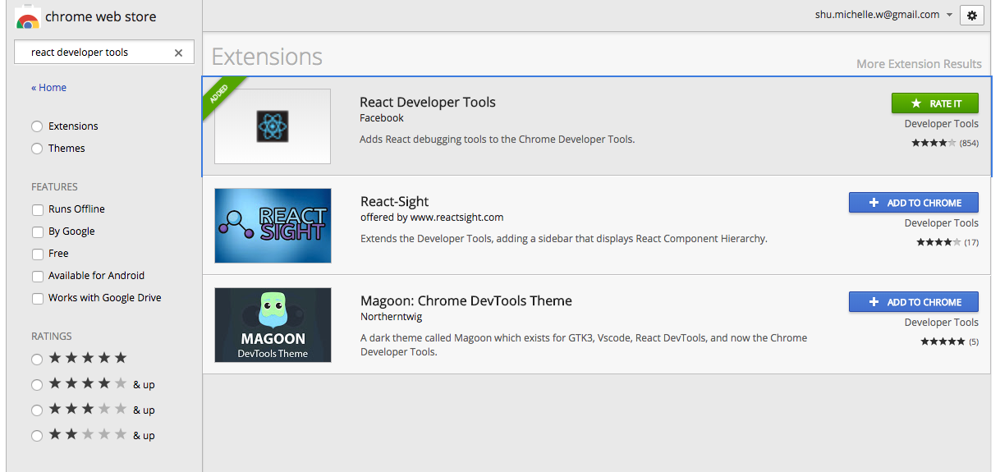

[Back to Schedule](../schedule.md) | [Week 5 Homework](../homeworks/05.md)

# Week 5: React Part 1

## Introduction to React

## Components

We can think of everything in React as a **component**. If you think about the elements of a website, the `div`s, `span`s, `p`s etc., each of these is a reusable piece that has a specific purpose. React components take this concept one step further and provide a framework where you can provide interactive pieces of functionality in custom elements, which React interprets as custom tags. For instance, if you had a checkers game app, you could have a `<Checker />` component for each game piece.

It is very important when designing our web applications to break them down in a way such that we maximize our use of components. Any time you see a section of the app that can be treated as a contained element and piece of functionality, and/or is used multiple times in the app (like in a list or grid for instance), you should consider making it a separate component.

The React guide has provided a great guide to how to think about "componentizing" your web application projects, which you can check out here: [Thinking in React](https://reactjs.org/docs/thinking-in-react.html).

## React Dev Tools

A good tool we can use to inspect the React structure of an app is the React Dev Tools extension for Chrome. Go ahead and find the extension in the [Chrome Web Store](https://chrome.google.com/webstore/) called **React Developer Tools** and add it to Chrome. This extension will give you the ability to inspect a page broken down by its React components, in addition to the classic inspection of standard HTML elements. It will also allow us to check the properties and state of React components, which we will learn about later.

The React Chrome extension is the first option in the list here:



Let's now try to use the React Dev Tools extension to inspect a page that runs on React, like [Facebook](https://www.facebook.com) or [Codeacademy](https://www.codeacademy.com). What are the differences between the `Elements` tab and `React` tab in the Chrome inspector and which components do you see?

## Building a React App

To build our first React app, we will use a generator called [create-react-app](https://github.com/facebookincubator/create-react-app). The generator will give us the skeleton of the app and install all the dependencies needed, including React and React DOM. Here are the steps to install the generator and create a new app.

1. If you don't already have it, first install [NodeJS](https://nodejs.org/en/). This installation will give you a working version of NPM or Node Package Manager, a tool that you can use to install most open source JavaScript libraries. To read more about NPM, see its documentation [here](https://docs.npmjs.com/getting-started/what-is-npm).

2. With NPM installed, run the following in your terminal:

```
npm install -g create-react-app
```

This will install the **create-react-app** library globally on your computer so that you can use it from any folder.

3. To create a new React app, navigate to a folder where you want the app to live (like `Documents` for instance) and run:

`create-react-app hello-world`

This should add a folder called hello-world with some files inside including a `package.json` with all the Node dependencies needed and a `src` folder with some project files prepopulated.

4. **create-react-app** also includes some scripts we can use to run the application locally. We can see these defined in the `package.json` file. To run the application, simply navigate inside your `hello-world` folder and type:

```
npm start
```

You should see a Chrome tab pop up at `localhost:3000` with a page that says "Welcome to React".

Now, take a look at the files within the `src` and see if you can find where the text "Welcome to React" is defined and change this text to "Hello World". Navigate back to the Chrome window and you should see that the text is changed there as well!

## JSX and React DOM

You may be a little surprised to have found that the logic for the text of the page was defined in a JavaScript file rather than an HTML file, and that the JS file had HTML tags inside of it. This is an artifact of React's own language, JSX. Let's look to the guide here to learn more about how JSX works: [React JSX](https://reactjs.org/docs/introducing-jsx.html)

In React, we define a component by extending the class `React.Component`. The component class has a method defined on it called `render`, which returns the JSX template to output for that component. This JSX consists of HTML tags, but also has awareness of the JavaScript logic driving the interactivity of the component.

To get the component into the HTML markup of the app, we use `ReactDOM.render`. This will give us access to the DOM and the ability to render a component into it by providing the JSX tag for the component. We also reference an existing DOM element to load the component into.

Here is more on rendering elements in the React DOM: [React Rendering Elements](https://reactjs.org/docs/rendering-elements.html)

## Loading CSS into a React Application

Using external CSS in a React application is easy! All we have to do is to `import` the CSS file within a JavaScript file, usually it will be the main JS file where our root component is rendered into the React DOM. If you look at `index.js`, there is an example of it:

```
import './index.css';
```

## React Resources

[React Documentation](https://reactjs.org/docs/hello-world.html)

[React Official Tutorial](https://reactjs.org/tutorial/tutorial.html)

[Scotch Getting Started with React](https://scotch.io/tutorials/learning-react-getting-started-and-concepts)

## Homework

[Week 5 Homework](../homeworks/05.md)
