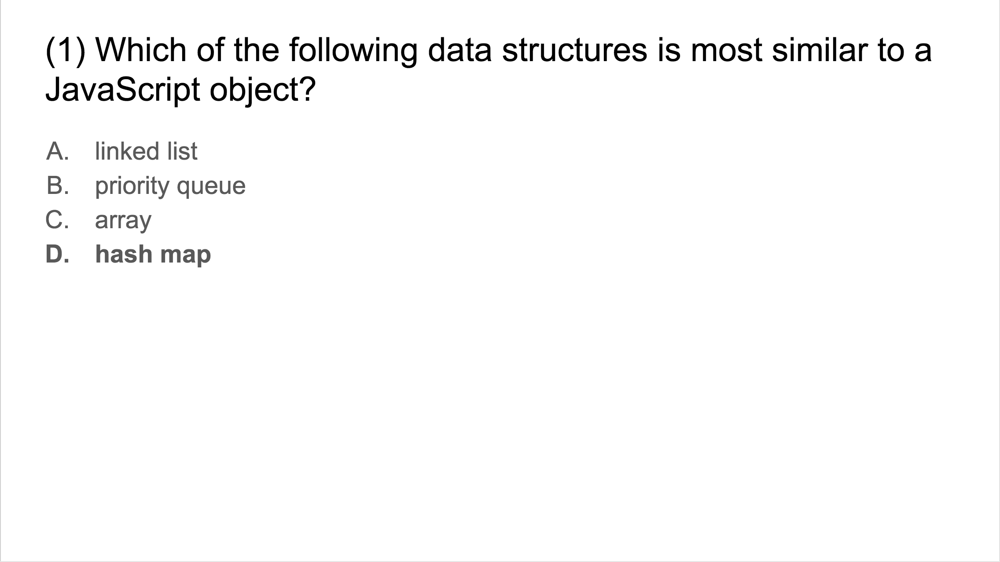
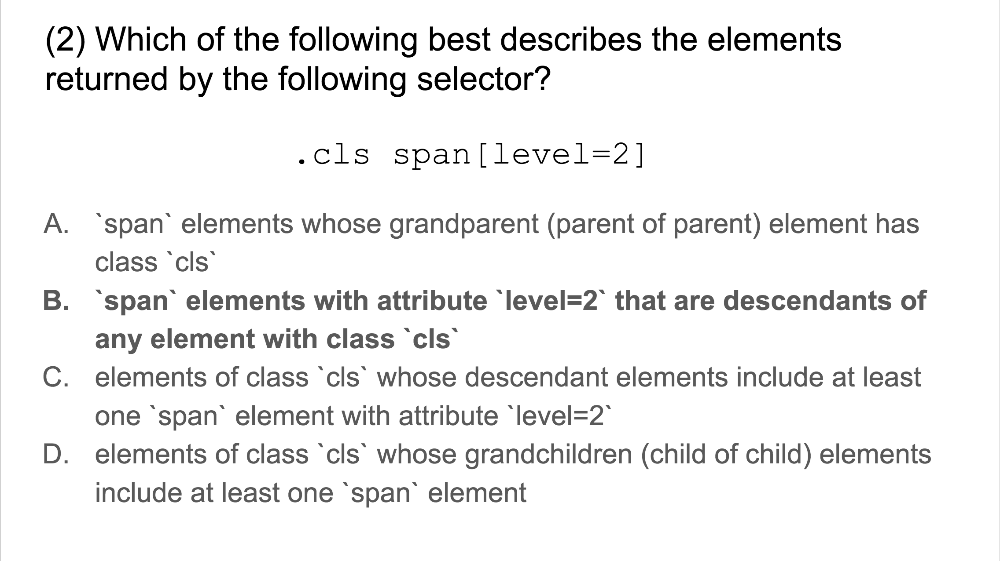
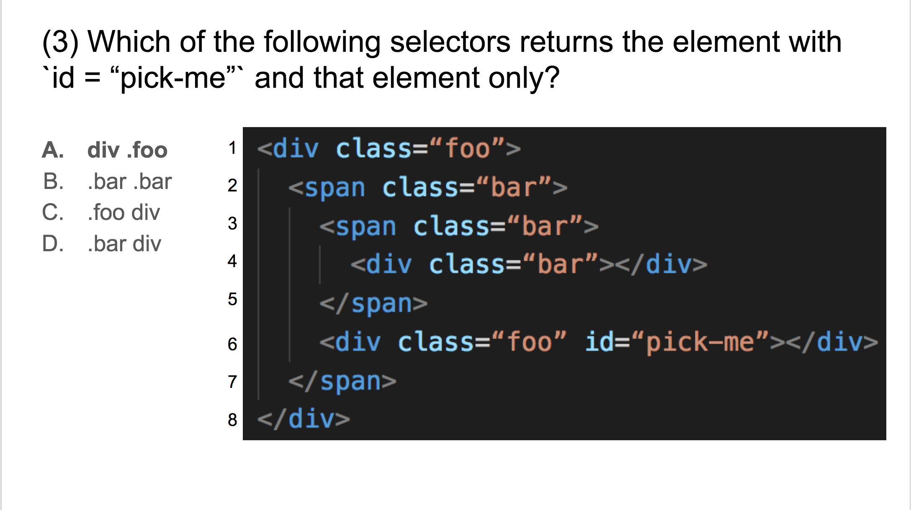
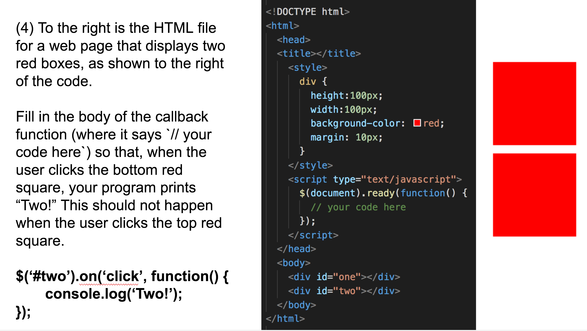
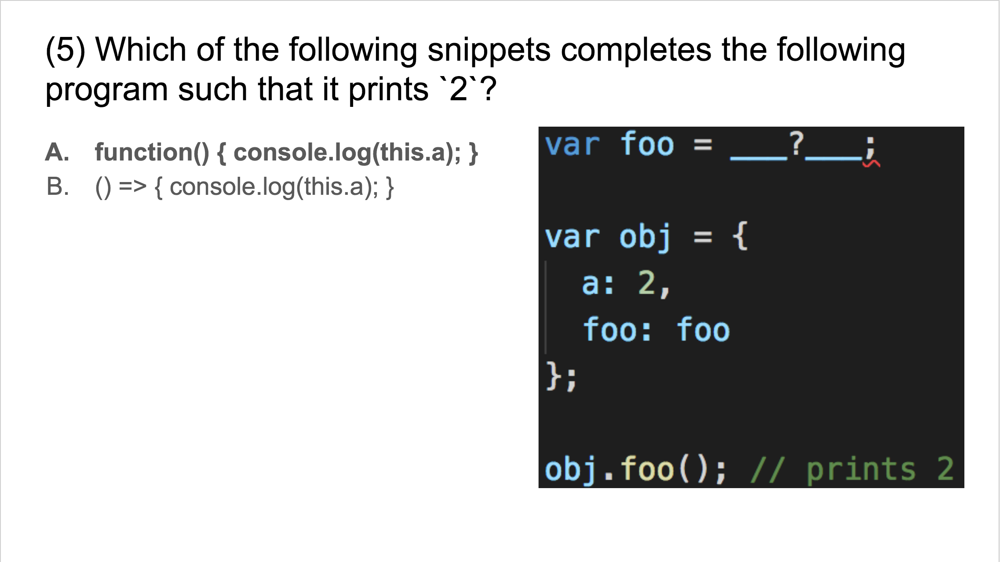
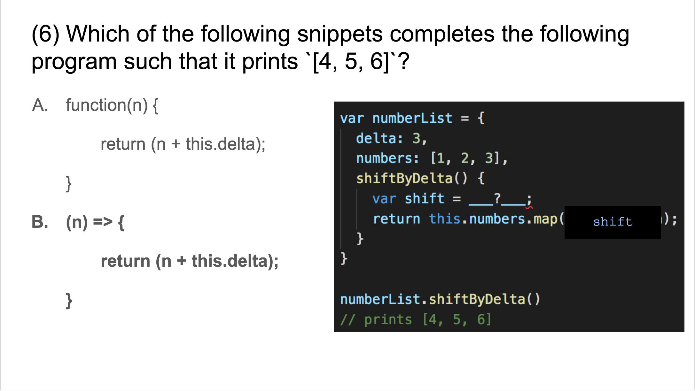
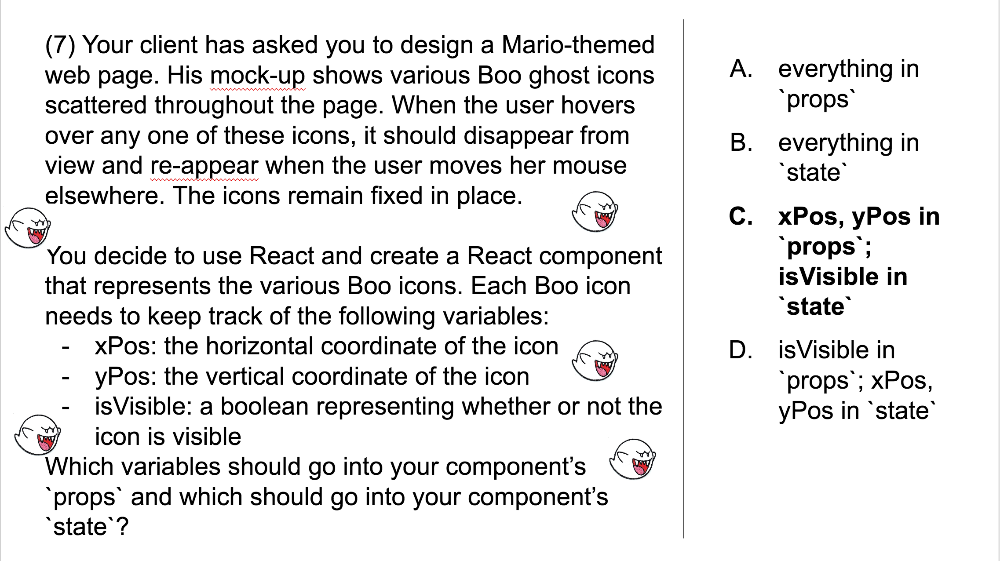

# Midterm Review

Below are the practice questions we reviewed in class, including solutions and discussions.

Course material that is fair game for this exam:
- Concepts covered in the Codecademy tutorials we have completed as prep. Specifically, this includes:
  - sections 'Introduction to CSS' and 'CSS Classes and IDs' in the [CSS tutorial](https://www.codecademy.com/en/tracks/web)
  - all of the [jQuery tutorial](https://www.codecademy.com/learn/learn-jquery)
- Concepts covered in the Preps we have completed so far, i.e., everything linked under the Prep column in the [schedule](https://michelleshu.github.io/web-development/schedule.html). This does not include external documentation (other than the Codecademy tutorials). I am also excluding the section titled `this` in [Prep 4](https://michelleshu.github.io/web-development/prep/04.html). However, I do expect you to understand the discussion in the discussion below on regular functions, arrow functions, and how they bind `this` differently.
- Everything covered in the practice questions below.


Some specific concepts you may wish to understand:
- how the various web technologies we have learned so far (HTML, CSS, JavaScript, jQuery, React, NPM) relate to each other and the roles that they play in the implementation of a web page (e.g., HTML specifies the abstract structural layout of a web page while CSS specifies the concrete styling of the web page)
- anything covered on CSS selectors in sections 'Introduction to CSS' and 'CSS Classes and IDs' of the Codecademy CSS tutorial
- JavaScript objects, classes, regular functions vs arrow functions
- the `map` function on JavaScript arrays
- defining and binding event handlers using jQuery
- defining and binding event handlers using React
- `props` vs `state` in a React component
- how to pass data up and down the React component hierarchy

---
---




A JavaScript object is a collection of key-value pairs. We usually refer to these pairs as the object properties, where the key is the property name and the value is the property value. Just like a map data structure, a JavaScript object cannot have duplicate keys.

---
---



The first token `.cls` identifies elements that look like `< ... class="cls" ... >`. The second token `span[level=2]` identifies elements that look like `<span ... level=2 ... >`. The space between the tokens tells us we are looking for elements identified by the second token that are contained within elements identified by the first token. Putting it all together, `.cls span[level=2]` identifies elements of the form `<span ... level=2 ... >` that are contained in elements of the form `< ... class="cls" ... >`.

In general, the last token in a CSS selector captures the features of the selected elements, while preceding tokens tell us the position of the selected elements relative to others. In this case, the fact that the last token is `span[level=2]` tells us that the selected elements are `span` elements. We could use this information to eliminate choices C and D. We could then eliminate choice A because the square brackets in `span[level=2]` specify an attribute.

---
---



The target element does not have the form `< ... class="bar" ... >`, so we can eliminate B. The remaining options all identify the target element; however, only A identifies the target element and that element only. Note that C and D both additionally identify the `div` element in line 4.

---
---



When writing jQuery code (or any JavaScript code that handles user interaction), you can break down your task into two main steps.
- First, you come up with the selector needed to identify the target element---in this case, our selector is `#two`. Passing this selector into jQuery -- `$('#two')` -- returns a collection of DOM elements that match the selector.
- Second, once we have our desired DOM element(s), we define an event handler and bind it to the desired user interaction event. We do this by calling the jQuery's [`.on`](http://api.jquery.com/on/) function on the collection of selected DOM elements. The first argument specifies the type of event -- `'click'` -- and the second argument is the event handler -- `function() { console.log('Two!'); }`.

---
---

The next couple questions tested your understanding of the difference between regular functions and arrow functions in JavaScript. Before discussing those questions, let's look at a separate example that will help clarify this distinction. I think you'll find this example much clearer and more concise than those I gave in class.

```javascript
01   var obj = {
02     a: 2,
03     regularFunctionsVsArrowFunctions() {
04
05       console.log("this.a:  " + this.a);
06       console.log("-----");
07
08       var regularFunction = function() { return this.a; };
09       var arrowFunction = () => { return this.a; };
10
11       console.log("Invoking regularFunction and arrowFunction as plain functions");
12       console.log("  regularFunction():  " + regularFunction());
13       console.log("  arrowFunction():    " + arrowFunction());
14       console.log("-----");
15
16       var differentObj = {
17         a: 3,
18         regularFn: regularFunction,
19         arrowFn: arrowFunction
20       };
21
22       console.log("Invoking regularFunction and arrowFunction as methods of an object")
23       console.log("  differentObj.regularFn():  " + differentObj.regularFn());
24       console.log("  differentObj.arrowFn():    " + differentObj.arrowFn());
25
26     }
27   };
28
29   obj.regularFunctionsVsArrowFunctions();
30   // this.a:  2
31   // -----
32   // Invoking regularFunction and arrowFunction as plain functions
33   //   regularFunction():  undefined
34   //   arrowFunction():    2
35   // -----
36   // Invoking regularFunction and arrowFunction as methods of an object
37   //   differentObj.regularFn():  3
38   //   differentObj.arrowFn():    2
```
Let's step through the body of `regularFunctionsVsArrowFunctions`. I've set up this example so that when we run `regularFunctionsVsArrowFunctions` on line 29, `this` is bound to `obj` in the body of `regularFunctionsVsArrowFunctions`. As a sanity check, we confirm this first by printing the value of `this.a` on line 05 and seeing that it is `2`. The printed output is shown in the comment block at the very bottom.

On lines 08 and 09, we define a `regularFunction` and an `arrowFunction`, both of which have the same body `{ return this.a; }`. We then invoke them as plain functions (that is, not as methods of an object and without any explicit binding of `this`). Invoked in this way, `regularFunction` returns `undefined` while `arrowFunction` returns `2`. What we see here is that `this` in the body of `arrowFunction` has been bound to `obj`, **the same object that is bound to `this` in the surrounding context**. By 'surrounding context', I mean specifically the context surrounding the **definition** of `arrowFunction`. On the other hand,  `regularFunction` binds its `this` differently depending on its **invocation**.

To see this invocation-based binding behavior of `regularFunction`, on line 16 we create a new object `differentObj` whose property `a` has value `3`. We also pass in `regularFunction` and `arrowFunction` so that they may be invoked as methods of `differentObj`. On line 23, when we invoke `regularFunction` as a method of `differentObj`, `regularFunction` binds its `this` to `differentObj` and thus returns `3`.

On the other hand, when we invoke `arrowFunction` as a method of `differentObj`, we still get `2`. This is because the `this` in the body of `arrowFunction` is bound upon definition. When we pass in `arrowFunction` into `differentObj`, we may as well have passed in a function that whose body is `{ return obj.a; }`.

---
---

Now let's return to the questions we looked at in class.




Here we pass the function `foo` into `obj` and invoke it as a method of `obj`. We want `this` to be bound to `obj` itself. If we define `foo` to be an arrow function, then we know that it already have its `this` to something by pass the first line, so it cannot bind its `this` to `obj`. Generally, whenever we want a function to bind its `this` in a flexible manner, we should think to use regular functions.



Here we pass the function `shift` into the `map` function. The `map` function applies the function `shift` to each element of the `numbers` array. We want to ensure that the `shift` function shifts by the value we have specified for `delta`, every time `shift` is invoked. There's no way we can ensure this with a regular function because we have no control over how `map` invokes `shift`. We need to use an arrow function to ensure that `this.delta` is always `3`.

---
---



Properties of a component's `props` object are those values passed in from the parent and which the component cannot itself modify. Properties of the `state` object are those values that are private to the component and that the component can modify. When deciding what to place in `props` vs `state`, it helps to think about what must be known by the parent.

Here, the `xPos` and `yPos` properties would have to be determined by some parent component that contains all the Boo icons, say, a `Main` component that represents the overall page. Hence, `xPos` and `yPos` go into `props`. On the other hand, the `Main` component does not need to be aware of whether a Boo icon is visible or not. `isVisible` can be managed by each Boo icon internally, hence it goes into the `state` object.

---
---

Some additional practice questions on React that we didn't cover in class but may help your studying.

1. [Short Answer] What is the purpose of NPM (Node Package Manager)?

    > It is a tool that allows you to bring external libraries, including open source, into a project; bonus: and manage the versions of those dependencies.

2. [Short Answer] What is one benefit of structuring an application into components?

    > Provides organization to code; build small composable, reusable pieces; abstract away details at higher levels, etc

3. [True or False] You can pass any type of JavaScript variable -- including objects, arrays, and functions -- as a prop to a child component.

    > True

4. [True or False] A component can use `this.setProps()` to modify the value of one of its props.

    > False

5. [Short Answer] Why do we call `super(props)` inside a constructor for a React component?
      ```jsx
      class MyComponent extends React.Component {
          constructor() {
              super(props);
          }
      }
      ```

    > `super()` invokes the constructor in the `React.Component` base class to set up the standard functionality and properties of a component

6. [Short answer] What will be displayed in the browser when the following code is run?

    ```jsx
    class LargeNumber extends React.Component {
        constructor(props) {
            super(props);

            this.state = {
                multiplier: 100
            };
        }

        render() {
            return (
                <p>{this.props.base * this.state.multiplier}</p>
            );
        }
    }

    class Sequence extends React.Component {
        constructor(props) {
            super(props);
            this.numbers = [5, 2, 9];
        }

        render() {
            return (
                <div class="sequence">
                    {this.numbers.map((number, index) => {
                        return <LargeNumber key={index} base={number} />;
                    })}
                </div>
            );
        }
    }

    ReactDOM.render(<Sequence />, document.getElementById('root'));
    ```

      > 500  
      > 200  
      > 900


7. [Short Answer] This code snippet tries to keep `myTextValue` in sync with what is entered in the input, but instead we will get an error. What is wrong with it?

    ```jsx
    class TextField extends React.Component {
        constructor(props) {
            super(props);
            this.state = {
                myTextValue: ''
            }
        }

        setTextValue(event) {
            this.setState({
                myTextValue: event.target.value
            });
        }

        render() {
            return <input type="text" onChange={this.setTextValue} />;
        }
    }
    ```

    > `setTextValue` is not bound to `this` in the constructor

8. [Short Answer] In the following code, I am trying to display an alert in `AlertContainer` when the button in `AlertButton` is clicked, but nothing is happening! What did I miss?

    ```jsx
    class AlertContainer extends React.Component {
        constructor(props) {
            super(props);

            this.displayAlert = this.displayAlert.bind(this);
        }

        displayAlert() {
            alert('Button was pressed!');
        }

        render() {
            return (
                <AlertButton displayAlert={this.displayAlert} />
            );
        }
    }

    class AlertButton extends React.Component {
        constructor(props) {
            super(props);
        }

        render() {
            return (
                <button onClick={this.state.displayAlert}>Alert!</button>
            );
        }
    }

    ReactDOM.render(<AlertContainer />, document.getElementById('root'));
    ```

    > `displayAlert` was passed in as a prop from the parent, so I should have `onClick={this.props.displayAlert})`
