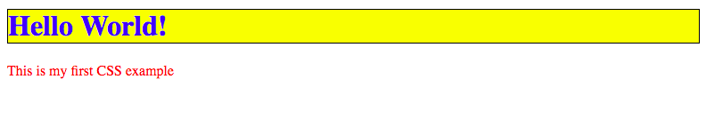
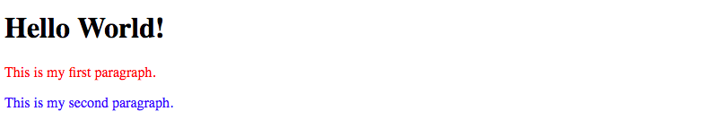
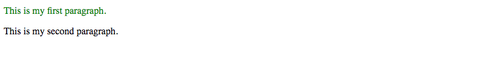

[Back to schedule](../schedule.md)

# Week 2 Pre-Class Prep: CSS

---

[What is CSS?](#what-is-css)

[CSS Class Selectors](#css-class-selectors)

[Nested Classes and Specificity](#nested-classes-and-specificity)

[The Box Model](#the-box-model)

[CSS Tutorial](#css-tutorial)

[Flexbox](#flexbox)

[Integrating stylesheets in HTML documents](#integrating-stylesheets-in-html-documents)

[Debugging CSS in the browser](#debugging-css-in-the-browser)

[Additional CSS Resources](#additional-css-resources)

---

## What is CSS?

CSS stands for **Cascading Style Sheets**. It is a language that complements HTML by specifying how the documents are styled and presented to users. While HTML defines the structure and content of a website, CSS tells the browser how to display it (including colors, fonts, borders and positioning). CSS documents contain **rules**, which consist of a set of **properties** and a **selector** which determines which elements to apply the properties to.

Here's a quick example of an HTML page (from [Mozilla's Intro to CSS](https://developer.mozilla.org/en-US/docs/Learn/CSS/Introduction_to_CSS)):

```html
<!DOCTYPE html>
<html>
  <head>
    <meta charset="utf-8">
    <title>My CSS experiment</title>
    <link rel="stylesheet" href="style.css">
  </head>
  <body>
    <h1>Hello World!</h1>
    <p>This is my first CSS example</p>
  </body>
</html>
```

and it's corresponding CSS:

```css
h1 {
  color: blue;
  background-color: yellow;
  border: 1px solid black;
}

p {
  color: red;
}
```

These CSS rules will decorate the HTML `h1` and `p` elements with the properties specified, so that the resulting web page will look like this:



---

## CSS Class Selectors

In the above example, we selected elements by their element type (`h1` and `p`). These styles would apply universally to every header and paragraph on the entire web page. This is useful if we want consistent styles across the board, however, in our projects, we often need to apply styles more specifically (e.g. to a particular paragraph instead of all paragraphs on the page).

To accomplish this, we can add class names to the paragraphs as shown below, with the `class="first-paragraph"` attribute, we label the first paragraph with a class called `first-paragraph`:

```html
<!DOCTYPE html>
<html>
  <head>
    <meta charset="utf-8">
    <title>My CSS experiment</title>
    <link rel="stylesheet" href="style.css">
  </head>
  <body>
    <h1>Hello World!</h1>
    <p class="first-paragraph">This is my first paragraph.</p>
    <p class="second-paragraph">This is my second paragraph.</p>
  </body>
</html>
```

Then, in the CSS we can reference the class with a selector consisting of a period followed by the class name, `.first-paragraph`:

```css
.first-paragraph {
  color: red;
}

.second-paragraph {
  color: blue;
}
```

With these CSS rules, the first paragraph will be red and the second will be blue:



There are many more ways to select certain elements other than applying classes to them (although class selectors are most common in practice). Here's a [fun game](https://flukeout.github.io/) you can play to learn about all the different types of CSS selectors available.

---

## Nested Classes and Specificity

To be even more specific, we can add the containing class to the CSS selector, for example `body .first-paragraph` would indicate the element inside the body tag with the `first-paragraph` class.

When there are multiple CSS rules for the same element, the one with the highest **specificity** always wins. When only one level of information is provided (i.e. selector only has one word in it), then the rules on specificity are as follows:
- A class (e.g. `.first-paragraph`) is always *more specific* than an element type (e.g. `p`).
- An ID (e.g. `#first-paragraph`) is always *more specific* than a class.

We can always add more specificity to a CSS rule by including more information on the containing elements. For example, take a look at the following HTML and CSS:

```html
<body>
  <div class="content">
    <div class="paragraphs">
      <p id="first" class="first-paragraph">This is my first paragraph.</p>
      <p class="second-paragraph">This is my second paragraph.</p>
    </div>
  </div>
</body>
```

```css
.first-paragraph {
  color: blue;
}

#first {
  color: green;
}

.content .paragraphs #first-paragraph {
  color: red;
}
```

The first rule on `.first-paragraph` is overridden by the second rule on `#first`, because the `id` attribute on an element is more specific than the `class` attribute. However, the third rule on `.content .paragraphs #first-paragraph` will override them both, because it contains more context about the elements enclosing the first paragraph: the `.content` and `.paragraphs` divs. Thus, the resulting color of the first paragraph is red.



---

## The Box Model

To establish the size and spacing of elements on a webpage, it's important to understand the **box model**. On the web, each element is represented as a rectangle, with padding, border and margin around it like the layers of an onion.


By adjusting the values of these properties, we are able to change the spacing within and between elements. It's important to remember that padding describes the spacing within an element between the content and border and margin describes the spacing outside of the border.

The exercise on [this page](https://developer.mozilla.org/en-US/docs/Learn/CSS/Introduction_to_CSS/Box_model) is a great place to start experimenting with the CSS box model properties.

---

## CSS Tutorial

Follow the CSS tutorial on [Codeacademy's HTML & CSS Course](https://www.codecademy.com/en/tracks/web). You should complete the sections titled **Introduction to CSS**, **CSS Classes and IDs**, and **CSS Element Positioning**.

---

## Flexbox

As an aside, one of the newer features of CSS that is most useful is a concept called **Flexbox**. While it's not necessary to understand flex properties, they are definitely a lifesaver when working with any type of web layout involving a grid-like structure (which pertains to most sites on the internet!). They are much easier to work with, more flexible and more responsive to different screen sizes than the classic CSS table. As we start working through projects, it's *highly recommended* that you take a look at this [flexbox resource](https://css-tricks.com/snippets/css/a-guide-to-flexbox/) and the examples at the bottom of the page to make working with CSS layouts a lot easier!

---

## Integrating stylesheets in HTML documents

It is best practice to keep our CSS in a `.css` file that is separate from the HTML. By adding a `link` reference to the CSS file in the `<head>` section of HTML, we can incorporate the CSS styles into the HTML page. To include the styles in `mystyle.css` for instance, we would include the following:

```html
<!DOCTYPE html>
<html>
  <head>
    <link rel="stylesheet" type="text/css" href="mystyle.css">
  </head>
  <body>
  </body>
</html>
```

---

## Debugging CSS in the browser

When our CSS is not producing the result we want, it can sometimes be hard to eyeball what is going wrong and how to correct it. Luckily the Google Chrome browser provides an excellent tool that we can use to understand what is going on, called the Chrome Debugger.

Go through [the exercise here](https://developers.google.com/web/tools/chrome-devtools/css/) to learn about how to use the Chrome Debugger to diagnose CSS issues. A good grasp of this tool will be crucially important as you begin to work on your own web development projects.

---

## Additional CSS Resources

[CSS Basics](http://www.cssbasics.com/)

[Mozilla Introduction to CSS](https://developer.mozilla.org/en-US/docs/Learn/CSS/Introduction_to_CSS)

[CSS Diner](https://flukeout.github.io/)

[Specifics on CSS Specificity](https://css-tricks.com/specifics-on-css-specificity/)

[Box Model](https://developer.mozilla.org/en-US/docs/Learn/CSS/Introduction_to_CSS/Box_model)

[Chrome Debugger for CSS](https://developers.google.com/web/tools/chrome-devtools/css/)

[Flexbox](https://css-tricks.com/snippets/css/a-guide-to-flexbox/)