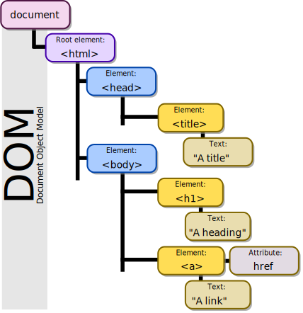

# Week 3 Prep: The DOM and jQuery

HTML and CSS alone allow you to create *static* webpages. That is, each page is a fixed HTML document.

Add JavaScript to the mix and you can start to create *dynamic* pages. Examples of dynamic webpage features include click-and-drag events in Google Calendar, and displaying a new chat bubble upon receiving a message in Facebook Messenger. In the first case, the underlying JavaScript code tells each HTML element representing a calendar event to listen for when it gets clicked and dragged and, when it does, re-position itself to following the user's mouse. In the second case, the JavaScript code sends requests to Facebook's servers at regular intervals (aka a [heartbeat](https://en.wikipedia.org/wiki/Heartbeat_(computing))) and, when the server responds with a new message, creates and displays a new HTML element styled as a chat bubble with the message content.

JavaScript code running in a web browser has access to three sources of input/output from/to the real world: (1) the HTML and CSS displayed to the user, (2) user interaction (e.g., click a button), and (3) requesting/receiving data from a server. To reinterpret our examples in the previous paragraph, the JavaScript code for click-and-drag events takes the form (2) -> (1), and the code for displaying chat messages in real time takes the form (3) -> (1).

This week, we'll learn how to write JavaScript code of the form (2) -> (1). In particular, we'll learn how to use jQuery, a widely used JavaScript library that makes it easier to interact with browser I/O.

> Note: While JavaScript was originally intended to be run in web browsers, it has since been leveraged in other domains, including [server-side scripting](https://en.wikipedia.org/wiki/Node.js) and [desktop application development](https://electronjs.org/). In this course, we will focus our attention on JavaScript in a browser run-time environment.

---

## The Document Object Model

Before we start using jQuery, let's see how we can access browser I/O with vanilla JavaScript.

The *Document Object Model (DOM)* is the programming interface between an HTML document and a programming language, which may or may not be JavaScript. In the case of JavaScript, every program has access to the global variable `document`. `document` is a DOM object that represents the currently displayed HTML page. If my HTML looks like this,
```html
<html>
  <head>
    <title>A title</title>
  </head>
  <body>
    <h1>A heading</h1>
    <a href="https://httpstatusdogs.com/">A link</a>
  </body>
</html>
```
then the object structure of `document` looks like this.



In other words, the DOM object captures the *tree structure* of an HTML document, where each node in the tree corresponds to an HTML element (or its text content or an element attribute), and lines between nodes capture the parent-child relationship between HTML elements. For example, the `<html>` element is the parent of the `<head>` element and the grandparent of the `<title>` element.

The `document` object also comes bundled with various methods for traversing and manipulating this tree structure. Any changes to `document` are reflected in the HTML displayed to the user. For example, consider the following JavaScript program.
```javascript
var heading = document.getElementsByTagName('h1')[0]; // document.getElementsByTagName('h1') returns an array of all live (i.e., visible) DOM objects with the tag name 'h1'
var newParagraph = document.createElement('p'); // create a new DOM object with tag name 'p', not yet live
var newParagraphText = document.createTextNode('A paragraph'); // create a new DOM object with the text content, not yet live
newParagraph.appendChild(newParagraphText); // add the text content to the 'p' object
heading.appendChild(newParagraph); // add the 'p' object to the live 'h1' object, thus making the 'p' object live
```
After this program runs, the HTML displayed by the browser would look like this.
```html
<html>
  <head>
    <title>A title</title>
  </head>
  <body>
    <h1>A heading</h1>
    <a href="https://httpstatusdogs.com/">A link</a>
    <p>A paragraph</p>
  </body>
</html>
```
You can find comprehensive documentation on the `document` object [here](https://developer.mozilla.org/en-US/docs/Web/API/Document) (methods are listed toward the bottom). Nowadays, very few web applications are developed in vanilla JavaScript, so we won't spend any more time on the particulars of the `document` object. The takeaways here are (1) the concept of the DOM and (2) the fact that libraries like jQuery and React are true JavaScript libraries, not extensions or variations of the language. That is, if you were a bored masochist, you could rewrite your React app using vanilla JavaScript.

---

## jQuery

jQuery is a JavaScript library that simplifies DOM traversal and manipulation. It is the [most widely used](https://w3techs.com/technologies/overview/javascript_library/all) of all JavaScript libraries. Compared to their vanilla JavaScript counterparts, jQuery code tends to be more concise, easier to read, and more portable by abstracting away [cross-browser inconsistencies](https://stackoverflow.com/questions/565641/what-cross-browser-issues-have-you-faced).

To prepare for next week's lab, work through Codecademy's [jQuery tutorial](https://www.codecademy.com/learn/learn-jquery). As you work through the tutorial, make sure to inspect the accompanying HTML and CSS files for every JavaScript file. Anything involving the DOM will make frequent use of CSS selectors, so please make sure you've completed Codecademy's CSS tutorial linked in last week's prep.

> Note: In case you're concerned about picking up a JavaScript library before you've written any JavaScript, the Codecademy tutorial will provide plenty of examples such that you'll pick up the necessary JavaScript syntax as you work through it. One thing I should mention beforehand, however, is that JavaScript supports [first-class functions](https://en.wikipedia.org/wiki/First-class_function). For example, consider below the first code example shown in the Codecademy jQuery tutorial. The `() => { ... }` expression is a function that takes 0 arguments. In JavaScript, you can pass functions around like objects (in fact, in JavaScript, functions *are* objects). We'll cover more of these details in Week 4.

```javascript
const login = document.getElementById('login');
const loginMenu = document.getElementById('loginMenu');

login.addEventListener('click', () => {
  if(loginMenu.style.display === 'none'){
    loginMenu.style.display = 'inline';
  } else {
    loginMenu.style.display = 'none';
  }
});
```