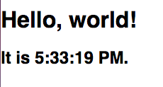
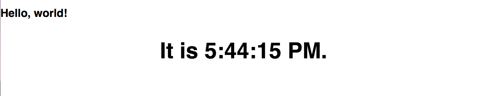

[Back to Schedule](../schedule.md)

# Week 5: React Part 1

---

[Intro to Components](#intro-to-components)

[React Dev Tools](#react-dev-tools)

[Building a React App](#building-a-react-app)

[JSX and React DOM](#jsx-and-react-dom)

[Loading CSS into a React Application](#loading-css-into-a-react-application)

[React Components](#react-components)

[React Resources](#react-resources)

---

## Intro to Components

We can think of everything in React as a **component**. If you think about the elements of a website, the `div`s, `span`s, `p`s etc., each of these is a reusable piece that has a specific purpose. React components take this concept one step further and provide a framework where you can provide interactive pieces of functionality in custom elements, which React interprets as custom tags. For instance, if you had a checkers game app, you could have a `<Checker />` component for each game piece.

It is very important when designing our web applications to break them down in a way such that we maximize our use of components. Any time you see a section of the app that can be treated as a contained element and piece of functionality, and/or is used multiple times in the app (like in a list or grid for instance), you should consider making it a separate component.

The React guide has provided a great guide to how to think about "componentizing" your web application projects, which you can check out here: [Thinking in React](https://reactjs.org/docs/thinking-in-react.html).

---

## React Dev Tools

A good tool we can use to inspect the React structure of an app is the React Dev Tools extension for Chrome. Go ahead and find the extension in the [Chrome Web Store](https://chrome.google.com/webstore/) called **React Developer Tools** and add it to Chrome. This extension will give you the ability to inspect a page broken down by its React components, in addition to the classic inspection of standard HTML elements. It will also allow us to check the properties and state of React components, which we will learn about later.

The React Chrome extension is the first option in the list here:


Let's now try to use the React Dev Tools extension to inspect a page that runs on React, like [Facebook](https://www.facebook.com) or [Codeacademy](https://www.codeacademy.com). What are the differences between the `Elements` tab and `React` tab in the Chrome inspector and which components do you see?

---

## Building a React App

To build our first React app, we will use a generator called [create-react-app](https://github.com/facebookincubator/create-react-app). The generator will give us the skeleton of the app and install all the dependencies needed, including React and React DOM. Here are the steps to install the generator and create a new app.

1. If you don't already have it, first install [NodeJS](https://nodejs.org/en/). This installation will give you a working version of NPM or Node Package Manager, a tool that you can use to install most open source JavaScript libraries. To read more about NPM, see its documentation [here](https://docs.npmjs.com/getting-started/what-is-npm).

2. With NPM installed, run the following in your terminal:

```
npm install -g create-react-app
```

This will install the **create-react-app** library globally on your computer so that you can use it from any folder.

3. To create a new React app, navigate to a folder where you want the app to live (like `Documents` for instance) and run:

`create-react-app hello-world`

This should add a folder called hello-world with some files inside including a `package.json` with all the Node dependencies needed and a `src` folder with some project files prepopulated.

4. **create-react-app** also includes some scripts we can use to run the application locally. We can see these defined in the `package.json` file. To run the application, simply navigate inside your `hello-world` folder and type:

```
npm start
```

You should see a Chrome tab pop up at `localhost:3000` with a page that says "Welcome to React".

Now, take a look at the files within the `src` and see if you can find where the text "Welcome to React" is defined and change this text to "Hello World". Navigate back to the Chrome window and you should see that the text is changed there as well!

---

## JSX and React DOM

You may be a little surprised to have found that the logic for the text of the page was defined in a JavaScript file rather than an HTML file, and that the JS file had HTML tags inside of it. This is an artifact of React's own language, JSX. Let's look to the guide here to learn more about how JSX works: [React JSX](https://reactjs.org/docs/introducing-jsx.html)

In React, we define a component by extending the class `React.Component`. The component class has a method defined on it called `render`, which returns the JSX template to output for that component. This JSX consists of HTML tags, but also has awareness of the JavaScript logic driving the interactivity of the component.

To get the component into the HTML markup of the app, we use `ReactDOM.render`. This will give us access to the DOM and the ability to render a component into it by providing the JSX tag for the component. We also reference an existing DOM element to load the component into.

See the following page on rendering elements in the React DOM: [React Rendering Elements](https://reactjs.org/docs/rendering-elements.html)

We will follow along here and create the ticking clock example from the React Docs in our React project that we just made with `create-react-app`.

In your React app directory (the `hello-world` folder we created previously), find the `index.js` file. It should look something like this:

```js
import React from 'react';
import ReactDOM from 'react-dom';
import './index.css';
import App from './App';
import registerServiceWorker from './registerServiceWorker';

ReactDOM.render(<App />, document.getElementById('root'));
registerServiceWorker();
```

Notice the line `ReactDOM.render(<App />, document.getElementById('root'));`. This is a function that tells the React DOM to render a `component` called 'App' inside the element with the ID of `root`. If you then look in the `index.html` file, you will notice that `root` is a div element in the main HTML file. We will get into component later, but for now, let's try to replace the `<App />` tag with the ticking clock example from React Docs. I've commented out the App component below and replaced it with the code for the clock:

```js
import React from 'react';
import ReactDOM from 'react-dom';
import './index.css';
// import App from './App';
import registerServiceWorker from './registerServiceWorker';

// ReactDOM.render(<App />, document.getElementById('root'));

function tick() {
  const element = (
    <div>
      <h1>Hello, world!</h1>
      <h2>
        It is{' '}
        {new Date().toLocaleTimeString()}.
      </h2>
    </div>
  );
  ReactDOM.render(
    element,
    document.getElementById('root')
  );
}

setInterval(tick, 1000);

registerServiceWorker();
```

When you run `npm start`, you should see the following:



This code tells React each second to render a new element that displays the current type. Since `tick()` is called every second, we are repeatedly telling `ReactDOM` to render a new element every second. You might be wondering why we can't just use the same element instead of having to regenerate it every time. This is because in React, elements are **immutable**, which means you can't change any of their children or attributes after it is rendered. In a later lesson, we will learn other ways to change a certain value without having to re-render through *props* and *state*.

---

## Loading CSS into a React Application

Using external CSS in a React application is easy! All we have to do is to `import` the CSS file within a JavaScript file, usually it will be the main JS file where our root component is rendered into the React DOM. If you look at `index.js`, there is an example of it:

```
import './index.css';
```

Try editing the element and CSS to style your clock to be in a larger font and centered on the screen:



---

## React Components

As we learned in the Intro on this page, **components** are a way to structure your UI into composable and reusable pieces. In practice, we choose to use components over what we did with the clock element above. This is largely because a React element will let us turn this:

```js
<div>
    <h1>Hello, world!</h1>
    <h2>
    It is{' '}
    {new Date().toLocaleTimeString()}.
    </h2>
</div>
```

into this:

```js
<Clock />
```

So whenever we have many of the same thing over and over again, it is easier to encapsulate and reuse.

See the following overview of **Components and Props** from the React Doc site: [Components and Props](https://reactjs.org/docs/components-and-props.html).

Try to follow along with all the examples by copying them to your `hello-world` application and seeing how they run in the browser. **Since the examples use App as the name of the component, you should first remove the existing files `App.css`, `App.js` and `App.test.js` from your project.**

The first section of the tutorial will explain that there are two ways to define your components: JavaScript functions and ES6 classes. While you can do either, it's generally preferred to try to use the class syntax where you write something like: `class Welcome extends React.Component { ... }` to use the full set of features that the JavaScript language has designed into classes.

When finished, you should have something like the CodePen example [here](https://codepen.io/pen?&editors=0010). Please save this code to your project as we will go over it in class.

---

## React Resources

[React Documentation](https://reactjs.org/docs/hello-world.html)

[React Official Tutorial](https://reactjs.org/tutorial/tutorial.html)

[Scotch Getting Started with React](https://scotch.io/tutorials/learning-react-getting-started-and-concepts)