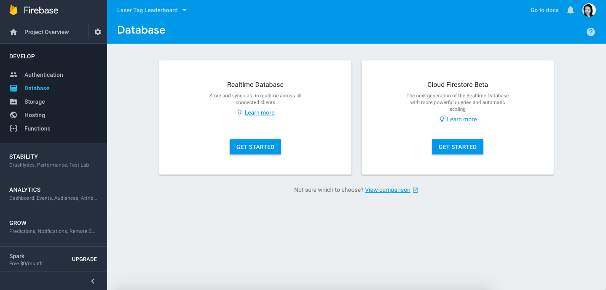
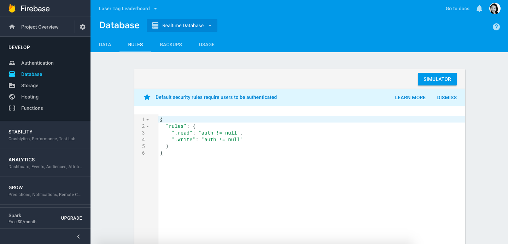

[Back to Schedule](../schedule.md)

# Week 9 Prep: Persisting Data with Firebase

---

## Intro to Firebase

Now we have a fully functioning leaderboard app where we can input scores in a form and have them reflected in individual and team leaderboard lists. One thing that is left to be desired though is being able to save the information that is entered, so that we can restart the application at another time and see the players that we previously put in already loaded.

Currently, when a player is added with the player submit form, that player's information is set as an object that React keeps track of while the app is running. However, once the browser window is closed, we lose this information, since it was only created within the DOM, but is never written or stored anywhere. Ideally, player data should be saved to a more permanent data store called a **database** so that we can reload it in another window and even when restarting the app.

We will be using a service from Google called **Firebase** for our database. Firebase makes it easy to manage data for your apps, because it sets up a database for you on one of its servers and makes it accessible in the cloud. This way, you don't have to worry about configuring and managing your own database from scratch. Moreover, data can be saved and edited in Firebase in real time as changes are made in the Leaderboard app, using a technology called **web sockets**. In this week's prep, we will see how to set that up!

## Create a Project in Firebase

To use Firebase, you must create a Google account or use and existing one. Go to [http://firebase.google.com/](http://firebase.google.com) and click "Go to Console" in the upper right:


After you get to the console, click Add Project, enter a name for your leaderboard project, and click Create Project:


When your new Firebase project is ready, you will be taken to the page below:



Notice that in the left hand menu, Firebase gives us a lot of functionality. You can use it for database (which we are looking to do now), authentication (user accounts, login, permissions), and even host your web app on the internet. For now we will click on Database, and then click on Get Started under **Realtime Database**.

You'll notice there is a message "Default security rules require users to be authenticated". By default, Firebase puts some default security on your database, but since we haven't set up authentication for this app, let's remove them for now so we can access our database without being authenticated.

Click on the Rules tab and you should see something like this:



To change the rules to give open access, replace the `auth != null`s to `true` like so:

```json
{
  "rules": {
    ".read": "true",
    ".write": "true"
  }
}
```

and then click **Publish**.