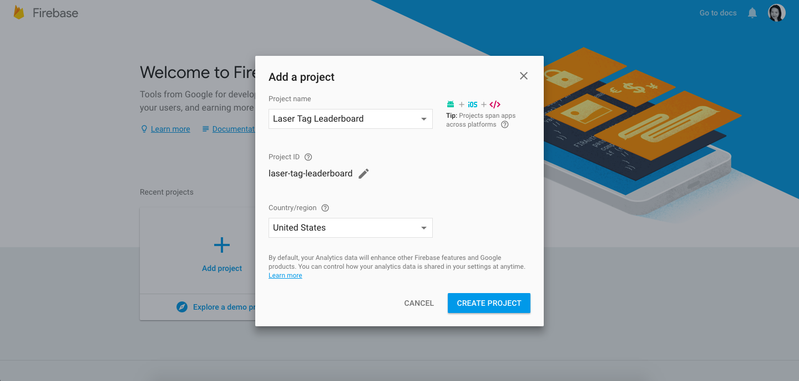
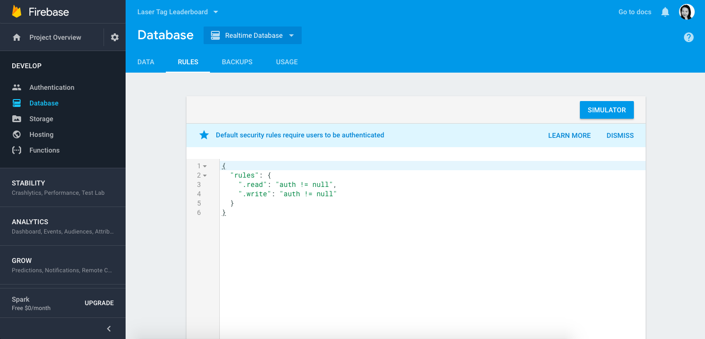
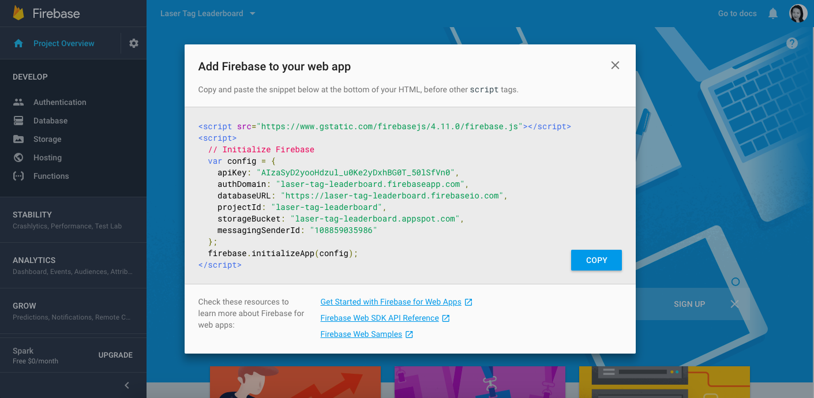
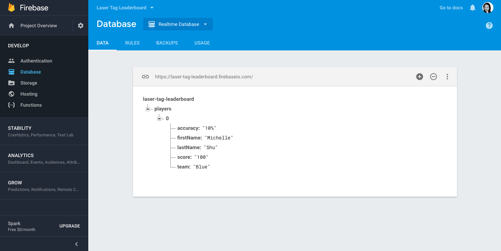
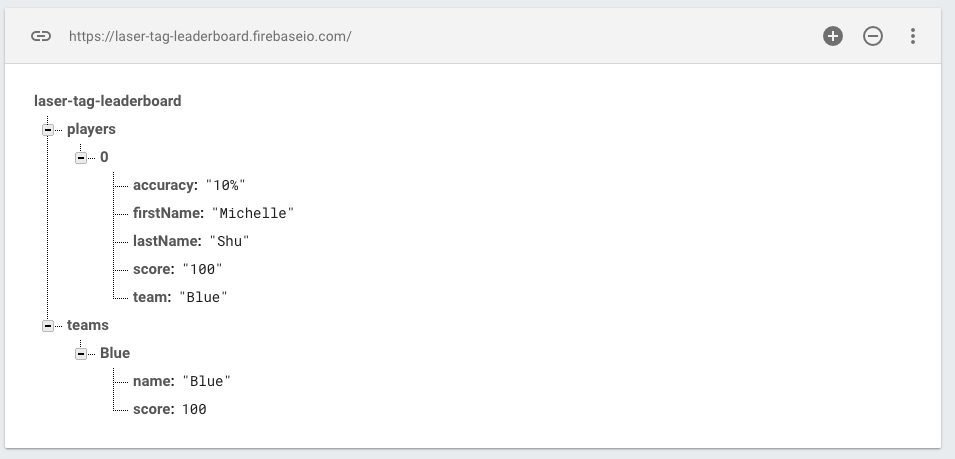

[Back to Schedule](../schedule.md)

# Week 11 Prep: Persisting Data with Firebase

---

[Lab 7 Solutions](#lab7-solutions)

[Intro to Firebase](#intro-to-firebase)

[Create a Project in Firebase](#create-a-project-in-firebase)

[Linking Your Application to Firebase](#linking-your-application-to-firebase)

[Save Players to Firebase](#save-players-to-firebase)

[Assignment](#assignment)

---

## Lab 7 Solutions

Please review the [Lab 7 Solutions](../notes/lab7-solutions.md) if you haven't already, and make the necessary updates to your application to get it in working state, as we will need it for this week's prep.

## Intro to Firebase

Now we have a fully functioning leaderboard app where we can input scores in a form and have them reflected in individual and team leaderboard lists. One thing that is left to be desired though is being able to save the information that is entered, so that we can restart the application at another time and see the players that we previously put in already loaded.

Currently, when a player is added with the player submit form, that player's information is set as an object that React keeps track of while the app is running. However, once the browser window is closed, we lose this information, since it was only created within the DOM, but is never written or stored anywhere. Ideally, player data should be saved to a more permanent data store called a **database** so that we can reload it in another window and even when restarting the app.

We will be using a service from Google called **Firebase** for our database. Firebase makes it easy to manage data for your apps, because it sets up a database for you on one of its servers and makes it accessible in the cloud. This way, you don't have to worry about configuring and managing your own database from scratch. Moreover, data can be saved and edited in Firebase in real time as changes are made in the Leaderboard app, using a technology called **web sockets**. In this week's prep, we will see how to set that up!

## Create a Project in Firebase

To use Firebase, you must create a Google account or use and existing one. Go to [http://firebase.google.com/](http://firebase.google.com) and click "Go to Console" in the upper right:


After you get to the console, click Add Project, enter a name for your leaderboard project, and click Create Project:



When your new Firebase project is ready, you will be taken to the page below:


Notice that in the left hand menu, Firebase gives us a lot of functionality. You can use it for database (which we are looking to do now), authentication (user accounts, login, permissions), and even host your web app on the internet. For now we will click on Database, and then click on Get Started under **Realtime Database**.

You'll notice there is a message "Default security rules require users to be authenticated". By default, Firebase puts some default security on your database, but since we haven't set up authentication for this app, let's remove them for now so we can access our database without being authenticated.

Click on the Rules tab and you should see something like this:



To change the rules to give open access, replace the `auth != null`s to `true` like so:

```json
{
  "rules": {
    ".read": "true",
    ".write": "true"
  }
}
```

and then click **Publish**. We will never do open permissions like this in a production ready application but we are skipping it for now since we have not yet set up authentication.

## Linking Your Application to Firebase

Now let's link our Leaderboard React application to the project we just created in Firebase. Directly under the `src/` folder in your leaderboard app, create a file called `base.js` and copy the following into it:

```js
import Rebase from 're-base';
import firebase from 'firebase';

// COPY CONFIG HERE

const firebaseApp = firebase.initializeApp(config);
const base = Rebase.createClass(firebaseApp.database());

export default base;
```

What this will do is first initialize a connection to our Firebase app as the `firebaseApp` constant, and then employ Rebase to help sync up a React state to the Firebase database. [Rebase](https://github.com/tylermcginnis/re-base) is a nifty helper that enables the state of a React app to sync seamlessly to Firebase as it is updated.

We now need to fill in the config above from your particular Firebase project. On the Firebase website, click on Project Overview in the left navigation and then click on **Add Firebase to your web app**. You should see a modal with some code defining a config object. The config there contains the keys you will need to hook up your React app with your Firebase project. Insert it into your base.js where it says `// COPY CONFIG HERE`. Note that you will only copy the `var config` part from that snippet. We don't need the script tags here.



Also remember that in order to use the external libraries **re-base** and **firebase**, we need to add them to `dependencies` under our `package.json`. Please look up the latest versions of these packages on the NPM website, add them to your `package.json`, and then run `npm install` to install them.

## Save Players to Firebase

Now we want to tell our app to sync the `players` state from `Main.js` to Firebase by using our re-base library. To do this, first import the base variable we just defined in `base.js` by copying this to the top of your `components/Main.js` file:

`import base from '../base';`

Then, inside of your Main component, we will add a hook to the lifecycle event called `componentDidMount` to sync the players to Firebase using `base`. Recall from "State and Lifecycle" in Prep 6 that this function will run each time the Main component is rendered to the DOM:

```js
componentDidMount() {
    this.playersRef = base.syncState('players', {
        context: this,
        state: 'players',
        asArray: true
    });
}
```

The above tells rebase to sync `this.state.players` from the current component to our Firebase application. `asArray` is set to true because players holds an array of player objects. We will also add `componentWillUnmount` to close out the connection after the Main component is destroyed (e.g. when leaving the page):

```js
componentWillUnmount() {
    base.removeBinding(this.playersRef);
}
```

Now try to run your leaderboard application and add a player in the AddPlayer form. When you then visit the Data tab under Database on the Firebase website, you should see the player info that you entered there. This will confirm that player data is saving successfully:



Now, the next time you load your React app, the player previously entered should automatically reload into the leaderboard! Your data has been saved to Firebase and syncs each time the Main component is loaded.

## Assignment

**Before class on 4/13, please get your teams data also synced up with Firebase. The code to write to do this should be very similar to the instructions above for players.**

This will involve adding another `base.syncState` for team in `componentDidMount`. **Since teams is not an array, do not include the asArray: true argument.** Make sure you save it to `this.teamsRef` and then remove the binding in `componentWillUnmount`, just as `this.playersRef` is handled.

When complete, both your individual and team leaderboard should have persisted state, which means that the player and team data entered should appear on following visits to the application. In Firebase, the synced data should appear in this format:



If at any point you make a mistake and want to clear the data saved to Firebase, you can do it from the above Firebase website. Just hover over the players and teams and click the X button to remove the currently saved data.

**Please submit your leaderboard with Firebase updates in a pull request by 4/13.**
