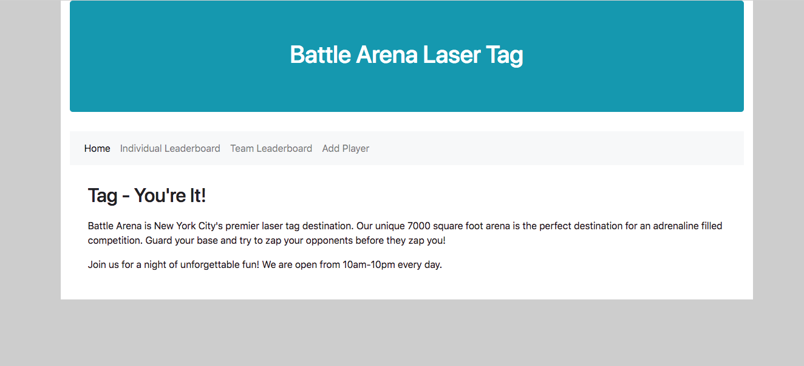

[Back to Schedule](../schedule.md)

# Week 12 Prep: React Router

---

[Single Page Applications and Routers](#single-page-applications-and-routers)

[Building the Application Frame](#building-the-application-frame)

[Linking Routes](#linking-routes)

---


## Single Page Applications and Routers

Many modern web applications fall under a category that we call "single page application" or SPA for short. In contrast to the traditional multi-page website (in which hyperlinks are used to navigate between different pages), in a single page application we never go to an entirely new page but instead load different views within the same page.

This makes the experience of navigation through a website faster and more seamless to a user. Although we are loading and changing to different views, the screen never goes completely blank as an entirely new page is loaded. Content is instead loaded inline within the same page itself. To see this in action, check out a website like Facebook or Youtube. Notice how even when you click on different links within the website, the top navigation bar never goes completely out of view to reload. It is always there and only the content below changes.

With single page applications, we have to do some extra work to ensure that the URL of the web page is consistent with the content that is shown. Users expect the URL to reflect the thing that they are viewing, and to be able to use it to reference a certain view. We also need to be able to use the back and forward buttons on our browser to navigate between visited views.

**Routing** is a system that is used by single page applications to solve this problem. It describes a way in which URLs are mapped to destinations that aren't separate HTML files. In React, there is a specific library we will use for this function called React Router. React Router provides a way to write your code such that certain components are shown only if the URL (the "route") matches what is defined.

## Building the Application Frame

When building an SPA, there will be a part of the page, usually surrounding the content, that will always be present. This part is sometimes referred to as an **application frame**. It could just be one invisible HTML element that wraps all the content (like a container div). But often, it includes some static elements such as a header, footer and navigation.

For our Leaderboard project, we will build an application frame with top navigation bar. The content will appear within the frame, and will be loaded dynamically by our application routing system, React Router.

Since we already have everything contained in the `Main.js` component, we will use this as the application frame. Instead of displaying the `IndividualLeaderboard`, `TeamLeaderboard`, and `AddPlayer` components all at once, we will put these in separate routes and load them into the container the user navigates to each.

Let's start off by commenting out our current `render()` method, and just adding the frame with a navigation bar element. **Keep everything else you have in Main.js, we are only commenting out render().**

Main.js
```js
// Comment out current render method for now
// render() {
//     return (
//         <div className="container">
//             <div className="jumbotron bg-info text-white text-center">
//                 <h1>Laser Tag Leaderboard</h1>
//             </div>
//             <IndividualLeaderboard players={this.state.players} />
//             <TeamLeaderboard teams={this.state.teams} />
//             <AddPlayer addToPlayers={this.addToPlayers} />
//         </div>
//     );
// }

// New render with application frame and nav bar
render() {
    return (
        <div className="container">
            <div className="jumbotron bg-info text-white text-center">
                <h1>Battle Arena Laser Tag</h1>
            </div>
            <nav className="navbar navbar-expand-lg navbar-light bg-light">
                <ul className="navbar-nav">
                    <li className="nav-item">
                        <a className="nav-link" href="#">Home</a>
                    </li>
                    <li className="nav-item">
                        <a className="nav-link" href="#">Individual Leaderboard</a>
                    </li>
                    <li className="nav-item">
                        <a className="nav-link" href="#">Team Leaderboard</a>
                    </li>
                    <li className="nav-item">
                        <a className="nav-link" href="#">Add Player</a>
                    </li>
                </ul>
            </nav>
            <div className="content">
            </div>
        </div>
    );
}
```

You should see something like this after running `npm start` (though feel free to style it differently):


As you can see, we've added a navigation bar and an empty placeholder div where the content will go.

Let's also go ahead and add a component with an introduction to the laser tag arena. This will be the content we see by default on the home page.

Create a component in the `components/` directory called `Home.js` and add a React class that extends React.Component with a simple `render()` method. Then incorporate your `<Home />` component inside of `Main.js` by including it in the div with className="content":

Home.js
```js
import React from 'react';

class Home extends React.Component {
    render() {
        return (
            // Your HOME content here
        );
    }
}
```

Main.js - render() method
```js
render() {
    return (
        <div className="container">
            <div className="jumbotron bg-info text-white text-center">
                <h1>Battle Arena Laser Tag</h1>
            </div>
            <nav className="navbar navbar-expand-lg navbar-light bg-light">
                <ul className="navbar-nav">
                    <li className="nav-item">
                        <a className="nav-link" href="#">Home</a>
                    </li>
                    <li className="nav-item">
                        <a className="nav-link" href="#">Individual Leaderboard</a>
                    </li>
                    <li className="nav-item">
                        <a className="nav-link" href="#">Team Leaderboard</a>
                    </li>
                    <li className="nav-item">
                        <a className="nav-link" href="#">Add Player</a>
                    </li>
                </ul>
            </nav>
            <div className="content">
                <Home />
            </div>
        </div>
    );
}
```

When finished, the content of your Home component will appear in the content div by default:



## Linking Routes

Now, for the exciting part! We will link to the components we previously created: Individual Leaderboard, Team Leaderboard and Add Player in our navbar with routes.

React Router provides two different kinds of routes:

- BrowserRouter
- HashRouter

BrowserRouter builds simple URLs without the hash symbol (e.g. http://www.app.com/leaderboard), whereas HashRouter builds the same URLs, but with a hash symbol (http://www.app.com/#/leaderboard). BrowserRouter is the choice used by most modern applications and preferred for newer browsers, so we will use it for our application.

There will be three main components we will use from React Router to define our routing behavior. Just like everything else in React, routing logic is also organized in component form. These are the special components defined by the React Router library:

- `BrowserRouter`: wraps the routing region where the links and routes reside
- `NavLink`: components that generate navigation links to routes
- `Route`: show or hide the components they contain based on the current route

To implement the routing for our navbar, we will first need to add the "react-router-dom" package to our `package.json` for our project and then use npm to install it.

After installing react-router-dom, go back to `Main.js` and import `BrowserRouter`, `NavLink`, and `Route`:

```js
import { BrowserRouter, NavLink, Route } from 'react-router-dom';
```

We will then implement the routing as follows:

```js
render() {
    return (
        <div className="container">
            <div className="jumbotron bg-info text-white text-center">
                <h1>Battle Arena Laser Tag</h1>
            </div>
            <BrowserRouter>
                <div>
                    <nav className="navbar navbar-expand-lg navbar-light bg-light">
                        <ul className="navbar-nav">
                            <li className="nav-item">
                                <NavLink to={"/"} className="nav-link" href="#">Home</NavLink>
                            </li>
                            <li className="nav-item">
                                <NavLink to={"/individual-leaderboard"} className="nav-link" href="#">Individual Leaderboard</NavLink>
                            </li>
                            <li className="nav-item">
                                <NavLink to={"/team-leaderboard"} className="nav-link" href="#">Team Leaderboard</NavLink>
                            </li>
                            <li className="nav-item">
                                <NavLink to={"/add-player"} className="nav-link" href="#">Add Player</NavLink>
                            </li>
                        </ul>
                    </nav>
                    <div className="content">
                        <Route exact path="/" render={() => <Home />} />
                        <Route exact path="/individual-leaderboard" render={() => <IndividualLeaderboard players={this.state.players} />} />
                        <Route exact path="/team-leaderboard" render={() => <TeamLeaderboard teams={this.state.teams} />} />
                        <Route exact path="/add-player" render={() => <AddPlayer addToPlayers={this.addToPlayers} />} />
                    </div>
                </div>
            </BrowserRouter>
        </div>
    );
}
```

You can see the following changes here:
- We have wrapped the navigation bar and the content in a `BrowserRouter`. This indicates the routing region of the application.
- The links in our navigation bar have been changed to `NavLinks`. NavLinks provide the links to display certain routes specified in the content section. In addition, they are styled based on the currently active route so that you can see the route that you're on based on the link style.
- The `Route`s in the content area specify what to render inside of content on each route. They are conditional on the `path` attribute matching the current route. In these Routes, we have `exact path` which means that for instance in: 
```
 <Route exact path="/individual-leaderboard" render={() => <IndividualLeaderboard players={this.state.players} />} />
```
only when the current route is exactly the same as `/individual-leaderboard` the `IndividualLeaderboard` will be displayed. The render method on the route determines which component to render when the path matches.

**Please submit your leaderboard with these React Router changes in a pull request by 4/18.**
