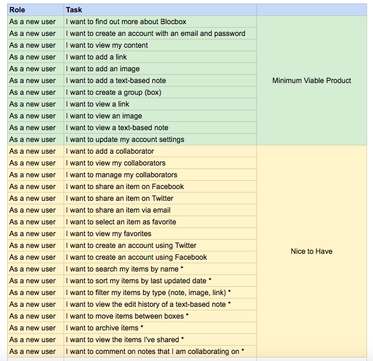

[Back to Schedule](../schedule.md)

# Project Week 1: User Experience and Interface Design

---

[Introduction to UX](#introduction-to-ux)
[Planning](#planning)
[Structure](#structure)

---

## Introduction to UX

As we build out web applications, it is important to consider the users' backgrounds and needs earlier in the process, rather than later.

Applications can be unintuitive and difficult to use. Content can be unpleasant to consume. The field of *user experience*, or "UX" for short, seeks to alleviate users of such difficulties. A good user experience should move the product aside, and connect a user directly to a solution. We can break UX design into four groups: planning, structure, layout and visual.

### Planning

While it may seem easy to target ourselves and our own likes when designing apps or web sites, remember that we are not always the type of person who will be using it. So meeting our needs doesn’t necessarily mean we are doing the right things or making the best choices.

Focus on the needs of the user to meet their goals while ensuring to meet the objectives and requirements of the product.

Interviewing potential users, developing personas and writing user stories can help plan and define the strategy for designing a web app.

### Structure

The structure of a product is defined through information architecture. User flows and site maps define how a person navigates in a web application and interprets the information.

### Layout

When we create wireframes by applying layout to the structure of our flows, we are completing the information design of a product: displaying content effectively to provide proper context.

### Visual

Visual design is what a user sees on the surface. This is the stylized layer of an application or web site. It’s also often all that people think of when they hear the word "design" and misconstrued as entirely what design consists of. Each of the other parts are important too, because without planning, structure and layout, we end up with an aesthetically pleasing product with flaws.

---

## Planning

In the planning phase, the key goal is to become familiar with our potential users and determine their requirements.

### User Surveys and Interviews

Typically, the first step is doing research about potential users' needs and desires through user surveys and interviews. Surveys help more with providing quantitative data with input from many people at once, and interviews take a deeper dive into qualitative information. While we won't have time in class to do a full user research sprint, there are some great tips on how this is done in the industry by Google Ventures:

[Google Ventures Research Sprint](https://library.gv.com/the-gv-research-sprint-a-4-day-process-for-answering-important-startup-questions-97279b532b25)

### Personas

Personas are semi-fictional artifacts created to help put a name, face and a backstory with potential users of the product. Each persona is like a person that represents a certain category or type of user. Creating personas allows us to develop empathy for the user, instead of designing something because we like it. These help us understand the users' goals, behaviors and how they will interact with the application. Personas are not to be used as rules, but as guidelines.

Personas can also help us:

- Determine and finalize requirements
- Create designs to solve the problem we're addressing
- Validate our concepts

A typical persona template consists of:

- Name
- Role: defined by behaviors
- Basic demographic information: including age, occupation, location, and gender
- Motivations: How does this person currently work? How would they benefit from this product?
- Goals: Primary goals they want to achieve using this product.
- Frustrations: Problems they face in their current workflow.
- Bio: A quick introduction into who this person is and what they do.

Here is an example of some personas that were constructed for an application for storing files and bookmarks on the web: [Personas](https://drive.google.com/open?id=15HtpEuoBJhMVSwzYBsu82bR5rBjtHpYM)

---

## Structure

Once we have a good idea of who our users are and what they want to achieve, we can begin structuring and defining our product from the perspective of the end user. We can start to flesh out the features (individual pieces of functionality) that we want to build by first listing them out in *user stories*, and then mapping out the entire experience of interacting with our application in a *user flow*.

### User Stories

User stories are short, simple descriptions of a feature told from the perspective of the user. They typically follow a simple template: As a <type of user>, I want <some goal> so that <some reason>.
  
When creating user stories, we simply want to brainstorm and jot down every little thing that we think should be able to be done in our application, and then rank them by importance.

For the storage and bookmark app, we may generate a list of user stories like this:

### User Flows

After we have the user stories, we can map out the paths that users can take in the application we are designing to accomplish the goals described.

A Google extension called Flow.io can help in making these flow chart diagrams. Or, you can do it the old fashioned way with pen and paper.

[User Flows](https://drive.google.com/file/d/0B5RCB7MPDa8Oc1hadFhvYXlMb0U/view?usp=sharing)
