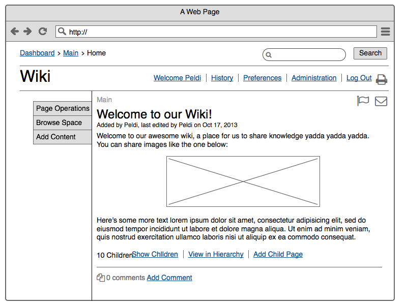
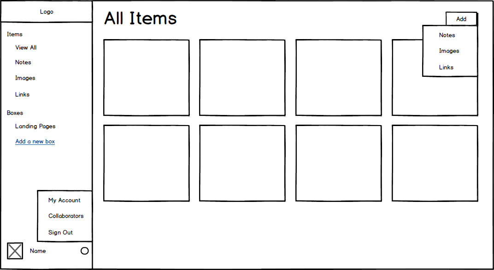
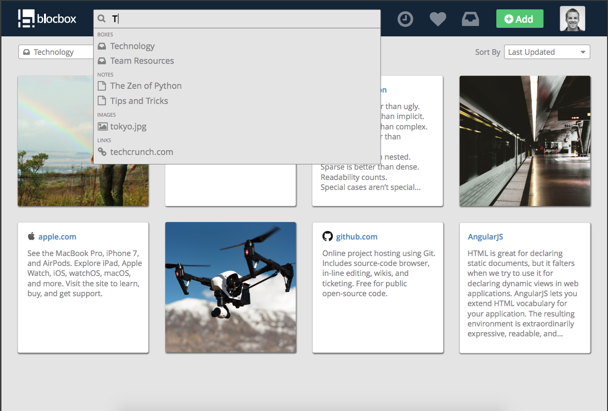

[Back to Schedule](../schedule.md)

# Project Week 1: User Experience and Interface Design

---

[Introduction to UX](#introduction-to-ux)

[Planning](#planning)

[Structure](#structure)

[Layout](#layout)

[Visual](#visual)

[Project Milestone](#project-milestone)

---

## Introduction to UX

As we build out web applications, it is important to consider the users' backgrounds and needs earlier in the process, rather than later.

Applications can be unintuitive and difficult to use. Content can be unpleasant to consume. The field of *user experience*, or "UX" for short, seeks to alleviate users of such difficulties. A good user experience should move the product aside, and connect a user directly to a solution. We can break UX design into four groups: planning, structure, layout and visual.

### Planning

While it may seem easy to target ourselves and our own likes when designing apps or web sites, remember that we are not always the type of person who will be using it. So meeting our needs doesn’t necessarily mean we are doing the right things or making the best choices.

Focus on the needs of the user to meet their goals while ensuring to meet the objectives and requirements of the product.

Interviewing potential users, developing personas and writing user stories can help plan and define the strategy for designing a web app.

### Structure

The structure of a product is defined through information architecture. User flows and site maps define how a person navigates in a web application and interprets the information.

### Layout

When we create wireframes by applying layout to the structure of our flows, we are completing the information design of a product: displaying content effectively to provide proper context.

### Visual

Visual design is what a user sees on the surface. This is the stylized layer of an application or web site. It’s also often all that people think of when they hear the word "design" and misconstrued as entirely what design consists of. Each of the other parts are important too, because without planning, structure and layout, we end up with an aesthetically pleasing product with flaws.

---

## Planning

In the planning phase, the key goal is to become familiar with our potential users and determine their requirements.

### User Surveys and Interviews

Typically, the first step is doing research about potential users' needs and desires through user surveys and interviews. Surveys help more with providing quantitative data with input from many people at once, and interviews take a deeper dive into qualitative information. While we won't have time in class to do a full user research sprint, there are some great tips on how this is done in the industry by Google Ventures:

[Google Ventures Research Sprint](https://library.gv.com/the-gv-research-sprint-a-4-day-process-for-answering-important-startup-questions-97279b532b25)

### Personas

Personas are semi-fictional artifacts created to help put a name, face and a backstory with potential users of the product. Each persona is like a person that represents a certain category or type of user. Creating personas allows us to develop empathy for the user, instead of designing something because we like it. These help us understand the users' goals, behaviors and how they will interact with the application. Personas are not to be used as rules, but as guidelines.

Personas can also help us:

- Determine and finalize requirements
- Create designs to solve the problem we're addressing
- Validate our concepts

A typical persona template consists of:

- Name
- Role: defined by behaviors
- Basic demographic information: including age, occupation, location, and gender
- Motivations: How does this person currently work? How would they benefit from this product?
- Goals: Primary goals they want to achieve using this product.
- Frustrations: Problems they face in their current workflow.
- Bio: A quick introduction into who this person is and what they do.

Here is an example of some personas that were constructed for an application for storing files and bookmarks on the web: [Personas](https://drive.google.com/open?id=15HtpEuoBJhMVSwzYBsu82bR5rBjtHpYM)

---

## Structure

Once we have a good idea of who our users are and what they want to achieve, we can begin structuring and defining our product from the perspective of the end user. We can start to flesh out the features (individual pieces of functionality) that we want to build by first listing them out in *user stories*, and then mapping out the entire experience of interacting with our application in a *user flow*.

### User Stories

User stories are short, simple descriptions of a feature told from the perspective of the user. They typically follow a simple template: As a <type of user>, I want <some goal> so that <some reason>.
  
When creating user stories, we simply want to brainstorm and jot down every little thing that we think should be able to be done in our application, and then rank them by importance.

For the storage and bookmark app, we may generate a list of user stories like this:

### User Flows

After we have the user stories, we can map out the paths that users can take in the application we are designing to accomplish the goals described. A user flow (or flow chart) focuses on tasks and goals, showing steps in sequential order to completion. Boxes and arrows are used to describe actions a user can take on a website to achieve specific tasks. Each box relates to a state of the application and each arrow describes an action that can move the user to the next logical step. Each user flow has a clear beginning and ending.

Based off of the User Stories described in the previous section, we can assemble multiple user flows, sequences of steps that a user can follow to satisfy the requirements of the user story.

A Google extension called Flow.io can help in making these flow chart diagrams. Or, you can do it the old fashioned way with pen and paper.

Here's an example of user flows for the storage and bookmarks app: [User Flows](https://drive.google.com/file/d/0B5RCB7MPDa8Oc1hadFhvYXlMb0U/view?usp=sharing)

---

## Layout

### Low Fidelity Wireframes

After mapping out user stories and flows, we are ready to begin thinking about what our web application will look like.

Low-fidelity wireframes are the first step in this process. They are simply sketches with basic lines and text to display content placement. Think of it as deciding "what goes where" on a page, and how to navigate between different views. Low fidelity wireframes are a place to start as we add all the necessary elements to our application and determine the best structure. They enable us to focus on navigation, and apply hierarchy to each page so users understand important actions.

Understand that at this step, we are not worried about styling or making things look good, simply to find a place for everything we need. Be sure to think carefully here about how to fulfill all our user stories but also present content in an intuitive manner to the user.

In the industry, [Balsamiq](https://www.balsamiq.com/) is a popular tool for creating low fidelity wireframes. These are some wireframes created in Balsamiq. As you can see, the sketchy style indicates that it is just a rough outline.

A good free alternative that can be used for this class is [Moqups](https://www.moqups.com/), and these can even be drawn by hand.

---

## Visual

### High Fidelity Wireframes

High fidelity wireframes are the final step in the design process before a web app idea is ready for development. This step involves putting finishing touches in the low fidelity designs. This step is usually done by visual designers, who are experts at applying color palettes, fonts, sizing and animations, among other visual features that will tie the design together and really make it look good.

The high fidelity wireframe should look and feel like the final product and is often built with sophisticated design tools such as Photoshop and Sketch. Some interactive designers will also use [Invision](https://www.invisionapp.com/) to create an interactive prototype where you can actually click around like a real app. The purpose of the high fidelity wireframe is to provide specs to the developer down to the pixel level of how everything should look and feel so it achieves the polished vision of the designer.

At this stage, high fidelity wireframes may look something like this:

Notice how there are a lot more colors and details than in the low fidelity wireframes of the previous step. The wireframe may also include photos and icons for visual detail.

---

## Project Milestone

This week, in your project teams, you will follow a few of the key steps of the UI/UX design process to envision and spec out the applications you will be building as your final project. Additionally, we will do the step of planning from in breaking down our final designs into React Components. The final deliverables due at next week's class are:

1. A short description of the application you plan to build.

2. Persona: Define one persona who may be interested in using your application. As in the examples above, include the following information about your persona: 
    - Name
    - Role: defined by behaviors
    - Basic demographic information: including age, occupation, location, and gender
    - Motivations: How does this person currently work? How would they benefit from this product?
    - Goals: Primary goals they want to achieve using this product.
    - Frustrations: Problems they face in their current workflow.
    - Bio: A quick introduction into who this person is and what they do.

3. User Stories: Create a list of user stories that your application will fulfill. This can be broken into two categories: the ones that are absolutely necessary, and the ones that are nice-to-haves, which you can add if you have the time. Please describe your user stories in the standard format of: As a user, I want to <some goal> so that <some reason>.

4. Low Fidelity Wireframes: Create low fidelity wireframes either by hand (pen and paper) or using [Moqups](https://www.moqups.com/)

5. React Component Breakdown: Review [Thinking in React](https://reactjs.org/docs/thinking-in-react.html) to think about which React components would comprise your application. List out the names of the components you plan to build and combine to make a working application. If possible, you can also label the components in your wireframe from Step 3. **You do not need to write any code for this step.**

There are many other steps in the design process, but since our time is limited, we've boiled it down to these 4. If you find it useful, by all means, your team can also utilize tools like user interviews, user flow and high fidelity wireframes to aid in your design process, but this is entirely optional.

